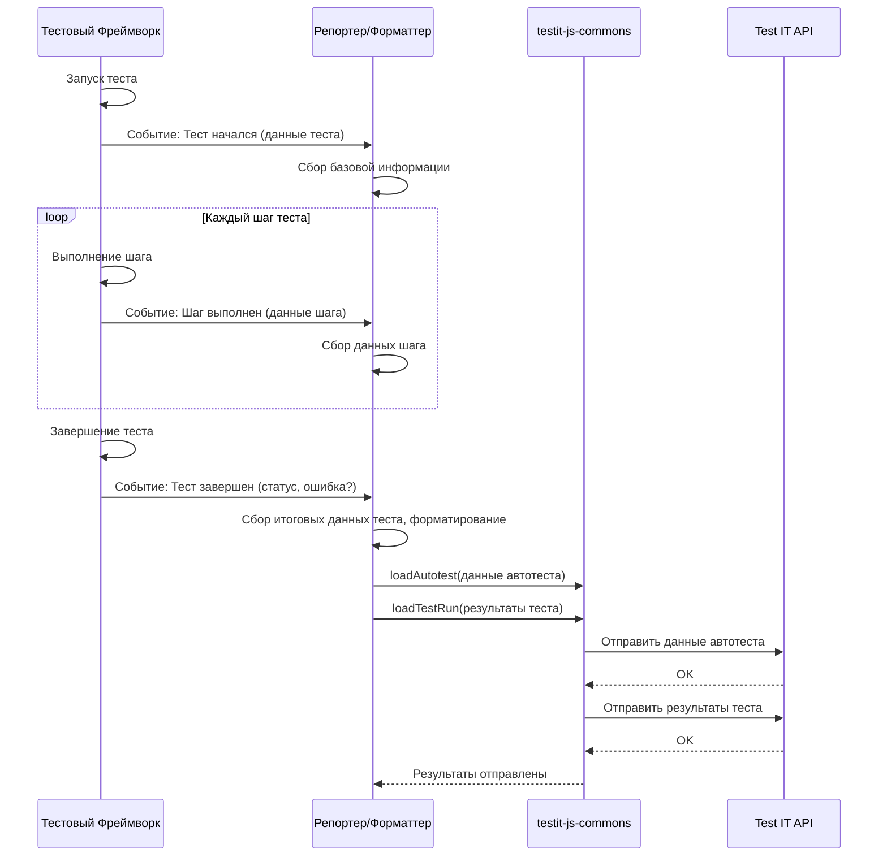

# Chapter 1: Репортер/Форматтер Адаптера


Добро пожаловать в руководство по `adapters-js`! В этой первой главе мы познакомимся с одним из ключевых компонентов интеграции — **Репортером/Форматтером Адаптера**.

## Зачем нужен Репортер/Форматтер?

Представьте, что вы используете популярный фреймворк для автоматизации тестирования, например, TestCafe, Mocha или Playwright. Вы написали тесты, запустили их, и они выполнились. Теперь перед вами стоит задача: **как передать результаты этих тестов в систему управления тестированием Test IT?**

Ведь каждый фреймворк работает по-своему: у них разные способы запуска тестов, разные форматы вывода результатов, разные события, которые происходят во время выполнения. Нам нужен специальный "посредник", который умеет "понимать" конкретный фреймворк и передавать информацию в Test IT в унифицированном виде.

Именно эту задачу и решает **Репортер/Форматтер Адаптера**.

## Что такое Репортер/Форматтер?

**Репортер/Форматтер** — это компонент, специфичный для каждого тестового фреймворка (TestCafe, Mocha, Cucumber и т.д.), который подключается непосредственно к этому фреймворку.

Его основные задачи:

1.  **"Слушать" события фреймворка:** Во время выполнения тестов фреймворк генерирует различные события: тест начался, тест завершился успешно, тест упал с ошибкой, начался новый шаг и т.д. Репортер "подписывается" на эти события.
2.  **Собирать информацию:** Когда происходит событие, репортер собирает всю необходимую информацию о нем: имя теста, статус (успех/провал), сообщение об ошибке, длительность выполнения и т.д.
3.  **Использовать общую библиотеку:** Для отправки собранных данных в Test IT репортер использует другой важный компонент — [Общую Библиотеку (testit-js-commons)](04_общая_библиотека__testit_js_commons__.md). Эта библиотека предоставляет стандартные методы для форматирования данных и отправки их в Test IT API.
4.  **Отправлять данные:** Репортер передает собранную информацию через `testit-js-commons` в Test IT.

**Аналогия:**

Представьте себе спортивного репортера, приставленного к конкретной футбольной команде (это наш тестовый фреймворк). Его задача — следить за ходом матча (выполнением тестов). Когда команда забивает гол (тест успешно завершился), пропускает мяч (тест упал) или происходит другое важное событие (начался новый шаг), репортер фиксирует это. Затем он составляет сводку (собирает данные о тесте) и отправляет ее по стандартному каналу связи (использует `testit-js-commons`) в центральную редакцию новостей (Test IT), чтобы все узнали результат.

У каждой "команды" (фреймворка) свой регламент и свои особенности, поэтому для каждой нужен свой "репортер", знающий эти особенности.

## Как это работает "под капотом"?

Хотя как пользователь вы чаще всего просто подключаете репортер через конфигурацию, полезно понимать, что происходит внутри.

**Общий поток данных:**

1.  **Запуск тестов:** Вы запускаете тесты с помощью вашего фреймворка (например, `npx testcafe chrome tests/`).
2.  **Генерация событий:** Фреймворк начинает выполнять тесты и генерирует внутренние события (начало теста, шаг, конец теста).
3.  **Перехват событий:** Наш Репортер/Форматтер, подключенный к фреймворку, "слышит" эти события.
4.  **Сбор и обработка данных:** Репортер извлекает из событий нужные данные (имя теста, статус, ошибки, метаданные). Он может преобразовывать их в формат, понятный для Test IT.
5.  **Вызов общей библиотеки:** Репортер использует функции из [Общей Библиотеки (testit-js-commons)](04_общая_библиотека__testit_js_commons__.md), в частности [Стратегию Интеграции (IStrategy & StrategyFactory)](05_стратегия_интеграции__istrategy___strategyfactory__.md), чтобы подготовить и отправить данные.
6.  **Отправка в Test IT:** Общая библиотека отправляет обработанные данные через API в ваш экземпляр Test IT.
7.  **Отображение в Test IT:** Вы видите результаты тестов в интерфейсе Test IT.

**Диаграмма последовательности (Упрощенная):**



**Примеры кода (из разных адаптеров):**

Посмотрим, как реализован перехват событий и отправка данных в разных адаптерах.

**1. testcafe-reporter-testit:**

TestCafe предоставляет специальный интерфейс для репортеров. Мы реализуем его методы.

```typescript
// Файл: testcafe-reporter-testit/src/index.ts

// ... импорты ...
import TmsReporter from './reporter'; // Наш класс репортера

// Этот объект экспортируется и используется TestCafe
module.exports = function() {
    return {
        reporter: null, // Здесь будет экземпляр нашего репортера

        // Метод вызывается TestCafe перед началом всего запуска
        async reportTaskStart(startTime: Date, userAgents: string[]): Promise<void> {
            // Создаем экземпляр нашего репортера
            this.reporter = new TmsReporter();
        },

        // Метод вызывается TestCafe после завершения каждого теста
        async reportTestDone(name: string, testRunInfo: TestRunInfo, meta: object): Promise<void> {
            // Передаем данные в наш репортер для обработки и отправки
            await this.reporter.onTestEnd(
                name,
                testRunInfo,
                meta,
                /* ... другие данные ... */);
        },

        // Метод вызывается TestCafe после завершения всего запуска
        async reportTaskDone(): Promise<void> {
            // Сообщаем нашему репортеру, что все тесты завершены
            await this.reporter.onEnd();
        },

        // ... другие методы для добавления ссылок, вложений ...
    };
}
```

Внутри `TmsReporter` (файл `reporter.ts`) происходит вызов общей библиотеки:

```typescript
// Файл: testcafe-reporter-testit/src/reporter.ts
import { ConfigComposer, StrategyFactory, IStrategy /* ... */ } from "testit-js-commons";
import { Converter } from "./converter"; // Вспомогательный класс для преобразования данных

export default class TmsReporter {
  strategy: IStrategy; // Экземпляр стратегии из commons
  // ... другие свойства ...

  constructor() {
    // Настройка конфигурации (подробнее в следующей главе)
    const config = new ConfigComposer().compose();
    // Создание стратегии через фабрику из commons
    this.strategy = StrategyFactory.create(config);
    // ...
  }

  // Вызывается из index.ts при завершении теста
  async onTestEnd(name: string, testRunInfo: TestRunInfo, meta: object, testData: any): Promise<void> {
    // Добавляем обработку теста в очередь
    await this.loadTestPromises.push(
      this.loadTest(/* ... параметры ... */)
    );
  }

  private async loadTest(/* ... параметры ... */): Promise<void> {
    // ... сбор и конвертация данных теста с помощью Converter ...
    const autotest = Converter.convertTestCaseToAutotestPost(/* ... */);
    const autotestResult = Converter.convertAutotestPostToAutotestResult(/* ... */);

    // Используем стратегию для отправки данных
    await this.strategy.loadAutotest(autotest, true); // Отправляем информацию об автотесте
    await this.strategy.loadTestRun([autotestResult]); // Отправляем результат выполнения
  }

  // ...
}
```

**2. testit-adapter-cucumber:**

Cucumber использует другую систему - "форматтеры" и поток событий (Envelopes).

```typescript
// Файл: testit-adapter-cucumber/src/formatter.ts
import { Formatter, IFormatterOptions } from "@cucumber/cucumber";
import { Envelope, TestCaseFinished /* ... */ } from "@cucumber/messages";
import { IStrategy, StrategyFactory /* ... */ } from "testit-js-commons";
// ...

export default class TestItFormatter extends Formatter implements IFormatter {
  private readonly strategy: IStrategy;
  // ...

  constructor(options: IFormatterOptions) {
    super(options);
    // ... настройка конфига и создание стратегии ...
    this.strategy = StrategyFactory.create(/* ... */);

    // Подписываемся на поток событий Cucumber
    options.eventBroadcaster.on("envelope", async (envelope: Envelope) => {
      // Обрабатываем разные типы событий...
      if (envelope.testCaseFinished) {
        return this.testCaseFinished(envelope.testCaseFinished);
      }
      if (envelope.testRunFinished) {
        // По завершении всего прогона отправляем результаты
        return this.onTestRunFinished(/* ... */);
      }
      // ... другие обработчики ...
    });
  }

  // Метод вызывается при завершении тест-кейса
  testCaseFinished(testCaseFinished: TestCaseFinished): void {
    // Сохраняем результат теста во внутреннем хранилище
    this.storage.saveTestCaseFinished(testCaseFinished);
    // ...
  }

  // Метод вызывается при завершении всего тестового запуска
  async onTestRunFinished(/* ... */): Promise<void> {
    // Получаем накопленные результаты из хранилища
    const results = this.storage.getTestRunResults();
    const autotests = this.storage.getAutotests();

    // Отправляем информацию об автотестах (опционально, если нужно создать или обновить)
    await Promise.all(
      autotests.map((autotestPost) => /* ... */ this.strategy.loadAutotest(/* ... */))
    );

    // Отправляем результаты выполнения тестов
    await this.strategy.loadTestRun(results);

    // Завершаем работу стратегии (например, закрываем соединение)
    await this.strategy.teardown();
  }

  // ... методы для добавления ссылок, аттачей ...
}
```

**3. testit-adapter-jest:**

Jest использует концепцию "Test Environment", которая позволяет перехватывать события жизненного цикла тестов.

```typescript
// Файл: testit-adapter-jest/src/testitEnvironment.ts
import NodeEnvironment from "jest-environment-node";
import { Event } from "jest-circus"; // Типы событий Jest
import { IStrategy, StrategyFactory /* ... */ } from "testit-js-commons";
// ...

export default class TestItEnvironment extends NodeEnvironment {
  private readonly strategy: IStrategy;
  // ... другие свойства для хранения данных о тестах ...

  constructor(/* ... */) {
    super(/* ... */);
    // ... настройка конфига и создание стратегии ...
    this.strategy = StrategyFactory.create(/* ... */);
    // ...
  }

  // Главный метод обработки событий Jest
  async handleTestEvent(event: Event) {
    switch (event.name) {
      // ... обработка начала/конца хуков (beforeAll, afterEach...) ...

      // Событие: тест завершен (успешно или с ошибкой)
      case "test_done": {
        // Сохраняем результат и связанные данные
        await this.saveResult(event.test);
        break;
      }

      // Событие: весь тестовый прогон завершен
      case "run_finish": {
        // Отправляем все накопленные результаты в Test IT
        await this.loadResults();
        break;
      }
      // ... другие события ...
    }
  }

  // Метод для сохранения результатов одного теста
  async saveResult(test: Extract<Event, { name: "test_done" }>["test"]) {
    // ... сбор данных о результате (статус, ошибки, длительность) ...
    const result: AutotestResult = { /* ... данные результата ... */ };

    // Сохраняем информацию об автотесте и его результат во временные массивы
    this.autotests.push(this.autotestData);
    this.autotestResults.push(result);
    // ... сброс временных данных для следующего теста ...
  }

  // Метод для отправки всех результатов после завершения прогона
  async loadResults() {
    // ... ожидание загрузки вложений ...

    const resultsToSend: AutotestResult[] = [];
    for (let i = 0; i < this.autotests.length; i++) {
      const autotestData = this.autotests[i];
      const resultData = this.autotestResults[i];
      // ... формирование объекта AutotestPost ...
      const autotestPost: AutotestPost = { /* ... данные автотеста ... */ };

      // Отправляем информацию об автотесте
      await this.strategy.loadAutotest(autotestPost, resultData.outcome === "Passed");

      // Формируем итоговый результат для отправки
      resultsToSend.push({ /* ... полные данные результата ... */ });
    }

    // Отправляем все результаты одним пакетом
    await this.strategy.loadTestRun(resultsToSend);
  }

  // ... методы для добавления метаданных (externalId, displayName, ...) ...
}
```

Как видите, хотя детали реализации отличаются (разные методы, разные события), **общий принцип остается тем же**:

1.  Подключиться к механизму событий фреймворка.
2.  Собрать данные о тестах и их выполнении.
3.  Использовать [Общую Библиотеку (testit-js-commons)](04_общая_библиотека__testit_js_commons__.md) ([Стратегию Интеграции](05_стратегия_интеграции__istrategy___strategyfactory__.md)) для отправки данных в Test IT.

## Заключение

Репортер/Форматтер — это мост между вашим тестовым фреймворком и Test IT. Он "переводит" события и результаты тестов с языка конкретного фреймворка на универсальный язык, понятный Test IT, используя для этого [Общую Библиотеку (testit-js-commons)](04_общая_библиотека__testit_js_commons__.md). Для каждого фреймворка существует свой специализированный репортер.

В следующей главе мы подробнее рассмотрим, как настраивается конфигурация для этих адаптеров с помощью компонента [Менеджер Конфигурации (ConfigComposer)](02_менеджер_конфигурации__configcomposer__.md).

---

Generated by [AI Codebase Knowledge Builder](https://github.com/The-Pocket/Tutorial-Codebase-Knowledge)