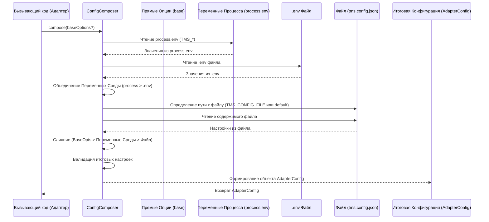

# Chapter 2: Менеджер Конфигурации (ConfigComposer)


В [предыдущей главе](01_репортер_форматтер_адаптера_.md) мы узнали о [Репортере/Форматтере Адаптера](01_репортер_форматтер_адаптера_.md), который собирает результаты тестов из вашего фреймворка. Но чтобы он мог отправить эти результаты в Test IT, ему нужно знать *куда* отправлять (адрес вашего Test IT), *кто* отправляет (ваш приватный токен), *в какой проект* отправлять и другие важные детали. Откуда адаптер берет всю эту информацию?

Именно здесь на сцену выходит **Менеджер Конфигурации (ConfigComposer)**.

## Зачем нужен Менеджер Конфигурации?

Представьте, что вы настраиваете адаптер для своего проекта. Вам нужно указать ему:

*   `URL` вашего сервера Test IT.
*   Ваш `Private Token` для доступа к API.
*   `ID` проекта в Test IT, куда будут загружаться результаты.
*   `ID` конфигурации в Test IT.
*   `ID` существующего тест-рана, если вы хотите добавить результаты в него, или правило для создания нового.

Но где хранить эти настройки?

1.  Можно создать специальный файл конфигурации (например, `tms.config.json`).
2.  Можно использовать переменные окружения (например, установить `TMS_PRIVATE_TOKEN` в вашей CI/CD системе, чтобы не хранить его в коде).
3.  Иногда удобно передать некоторые опции прямо при запуске тестов (например, из файла `jest.config.js`).

Как видите, настройки могут поступать из разных мест. **ConfigComposer** решает проблему сбора, объединения и определения приоритетов этих настроек, чтобы адаптер получил единый, понятный набор инструкций для работы.

## Что такое ConfigComposer?

**Менеджер Конфигурации (ConfigComposer)** – это компонент внутри нашей [Общей Библиотеки (testit-js-commons)](04_общая_библиотека__testit_js_commons__.md), который отвечает за формирование финального объекта конфигурации для адаптера.

Его основные задачи:

1.  **Найти источники конфигурации:** Он ищет настройки в предопределенных местах.
2.  **Прочитать настройки:** Извлекает значения из найденных источников.
3.  **Объединить настройки:** Собирает все найденные параметры в один объект.
4.  **Установить приоритеты:** Если одна и та же настройка задана в нескольких местах, `ConfigComposer` решает, какое значение использовать (например, переменная окружения обычно важнее значения из файла).
5.  **Вернуть финальную конфигурацию:** Предоставляет готовый объект `AdapterConfig` для использования остальными частями адаптера.

**Аналогия:**

Вернемся к аналогии с секретарем из описания. `ConfigComposer` — это ваш личный секретарь по настройкам.

*   У вас есть **основные инструкции** в документе (`tms.config.json`).
*   Иногда приходит **срочное указание** от начальства по email (переменные окружения, например `TMS_PROJECT_ID=xyz`).
*   А иногда вы даете **устное распоряжение** для конкретной задачи (опции, переданные напрямую коду).

Секретарь (`ConfigComposer`) собирает все эти инструкции. Если в email сказано использовать проект `xyz`, а в документе — проект `abc`, секретарь понимает, что email (переменная окружения) имеет больший приоритет. Если вы лично сказали использовать проект `qwerty` (прямая опция), то это указание будет самым главным. В итоге секретарь формирует единый, непротиворечивый план действий (`AdapterConfig`) для исполнителя ([Репортера/Форматтера](01_репортер_форматтер_адаптера_.md) и [Стратегии Интеграции](05_стратегия_интеграции__istrategy___strategyfactory_.md)).

## Источники конфигурации и их приоритеты

`ConfigComposer` ищет настройки в следующих местах, в порядке **убывания** приоритета (то есть, настройки из пункта 1 переопределяют настройки из пункта 2, и так далее):

1.  **Прямые опции (Base Options):** Параметры, переданные напрямую в метод `compose()` при создании конфигурации. Это самый высокий приоритет. Удобно для динамической настройки в коде (например, в `jest.config.js`).
2.  **Переменные окружения процесса (Process Environment Variables):** Системные переменные окружения (например, `process.env.TMS_URL`). Часто используются в CI/CD системах.
3.  **Переменные из `.env` файла:** Если в корне вашего проекта есть файл `.env`, `ConfigComposer` прочитает переменные из него. Это удобно для локальной разработки. *Примечание: Переменные окружения процесса (пункт 2) переопределяют значения из `.env` файла.*
4.  **Файл конфигурации (`tms.config.json`):** Специальный JSON-файл (имя по умолчанию `tms.config.json`, но может быть изменено через переменную окружения `TMS_CONFIG_FILE`). Это базовый способ задания настроек.

**Пример:**

Допустим, у вас есть:

*   **`tms.config.json`**:
    ```json
    {
      "url": "https://default.testit.local",
      "projectId": "project-from-file",
      "adapterMode": 0
    }
    ```
*   **`.env` файл**:
    ```dotenv
    TMS_URL=https://env-file.testit.local
    TMS_PRIVATE_TOKEN=token-from-env-file
    ```
*   **Переменная окружения процесса**: `export TMS_PROJECT_ID=project-from-process-env`
*   **Прямые опции** в коде: `configComposer.compose({ adapterMode: 1 })`

`ConfigComposer` соберет итоговую конфигурацию так:

*   `url`: `https://env-file.testit.local` (из `.env`, так как он приоритетнее файла `tms.config.json`)
*   `privateToken`: `token-from-env-file` (из `.env`)
*   `projectId`: `project-from-process-env` (из переменной окружения процесса, так как она приоритетнее файла `tms.config.json`)
*   `adapterMode`: `1` (из прямых опций, самый высокий приоритет)
*   Другие настройки (например, `configurationId`) будут взяты из файла `tms.config.json`, если они там есть, или останутся неопределенными.

## Как использовать ConfigComposer?

Обычно вам не нужно напрямую вызывать `ConfigComposer`. Репортеры/форматтеры (как мы видели в [прошлой главе](01_репортер_форматтер_адаптера_.md)) делают это за вас при своей инициализации. Но полезно понимать, как это происходит.

```typescript
// Пример внутри адаптера (упрощенно)
import { ConfigComposer } from "testit-js-commons";

// 1. Создаем экземпляр ConfigComposer
const configComposer = new ConfigComposer();

// 2. Вызываем метод compose() для сборки конфигурации
//    Сюда можно передать базовые опции с наивысшим приоритетом
const finalConfig = configComposer.compose({
  // Пример: Передаем ID тест-рана, полученный динамически
  // testRunId: process.env.CI_TEST_RUN_ID
});

// 3. Используем полученный объект finalConfig
//    Например, передаем его в Стратегию Интеграции
// const strategy = StrategyFactory.create(finalConfig);

// Можно посмотреть итоговые значения
console.log('Итоговый URL:', finalConfig.url);
console.log('Итоговый Project ID:', finalConfig.projectId);
console.log('Режим адаптера:', finalConfig.adapterMode);

/* Ожидаемый вывод в консоли (зависит от ваших файлов и переменных):
Итоговый URL: https://env-file.testit.local
Итоговый Project ID: project-from-process-env
Режим адаптера: 1
*/
```

В этом примере `configComposer.compose()` выполняет всю работу по поиску, чтению и объединению настроек согласно правилам приоритета. Результатом является объект `finalConfig` типа `AdapterConfig`, который содержит все необходимые параметры для работы адаптера.

## Как это работает "под капотом"?

Давайте заглянем внутрь `ConfigComposer` и посмотрим, как он собирает конфигурацию шаг за шагом.

**Псевдо-код процесса `compose(baseOptions)`:**

1.  **Прочитать переменные окружения процесса:** Получить все переменные `process.env`, начинающиеся с `TMS_`.
2.  **Прочитать `.env` файл:** Загрузить переменные из файла `.env` (если он есть).
3.  **Объединить переменные среды:** Создать единый объект переменных среды, где `process.env` имеет приоритет над `.env`.
4.  **Определить путь к файлу конфигурации:** Проверить переменную среды `TMS_CONFIG_FILE`. Если ее нет, использовать имя по умолчанию `tms.config.json`.
5.  **Прочитать файл конфигурации:** Загрузить JSON-данные из файла (если он существует).
6.  **Объединить все источники:** Слить настройки из файла, объединенные переменные среды и `baseOptions` (прямые опции), соблюдая приоритет: `baseOptions` > Переменные Среды > Файл Конфигурации.
7.  **Валидация:** Проверить полученную конфигурацию на наличие обязательных полей и корректность форматов (например, URL, UUID). Вывести предупреждения или ошибки при необходимости.
8.  **Вернуть результат:** Отдать готовый объект `AdapterConfig`.

**Диаграмма последовательности (Упрощенная):**



**Ключевые фрагменты кода (из `testit-js-commons/src/helpers/config/config.helper.ts`):**

*   **Основной метод `compose`:** Организует весь процесс.

```typescript
// Файл: testit-js-commons/src/helpers/config/config.helper.ts

import * as dotenv from "dotenv"; // Для чтения .env
import { Utils, AdapterConfig, EnvironmentOptions /* ... */ } from "../../common";
// ...

export const DEFAULT_CONFIG_FILE = "tms.config.json"; // Имя файла по умолчанию

export class ConfigComposer implements IConfigComposer {
  public compose(base?: Partial<AdapterConfig>): AdapterConfig {
    // Шаг 1 и 2: Чтение переменных среды (process и .env)
    const processEnvironment = parseProcessEnvConfig();
    const dotEnvironment = parseDotEnvConfig();

    // Шаг 3: Объединение переменных среды
    const environment = this.mergeEnv(dotEnvironment, processEnvironment);

    // Шаг 4 и 5: Чтение файла конфигурации
    const filePath = environment.TMS_CONFIG_FILE ?? DEFAULT_CONFIG_FILE;
    const content = Utils.readFile(filePath); // Утилита для чтения файла
    let config: AdapterConfig;

    // Шаг 6: Объединение всех источников
    if (content !== "") {
      const fileConfig: AdapterConfig = JSON.parse(content);
      // Используем mergeAll, если есть файл
      config = this.mergeAll(fileConfig, environment, base);
    } else {
      // Используем merge, если файла нет (только среда и база)
      config = this.merge(environment, base);
    }

    // Шаг 7: Валидация
    this.validateConfig(config);

    // Шаг 8: Возврат результата
    return config;
  }

  // ... остальные методы mergeAll, merge, mergeEnv, validateConfig ...
}
```

*   **Метод слияния (например, `mergeAll`):** Показывает логику приоритетов.

```typescript
// Файл: testit-js-commons/src/helpers/config/config.helper.ts (продолжение)

  // Сливает все три источника: файл, среда, база
  public mergeAll(
    file: AdapterConfig,
    env?: Partial<EnvironmentOptions>,
    base?: Partial<AdapterConfig>
  ): AdapterConfig {
    return {
      // Для каждой настройки вызывается resolveAllProperties
      url: this.resolveAllProperties(file.url, env?.TMS_URL, base?.url),
      projectId: this.resolveAllProperties(file.projectId, env?.TMS_PROJECT_ID, base?.projectId),
      privateToken: this.resolveAllProperties(file.privateToken, env?.TMS_PRIVATE_TOKEN, base?.privateToken),
      // ... другие поля ...
      // Особая логика для boolean и adapterMode с значениями по умолчанию
      adapterMode: base?.adapterMode ?? env?.TMS_ADAPTER_MODE ?? file?.adapterMode ?? 0,
      // ...
    };
  }

  // Определяет итоговое значение поля по приоритету: base > env > file
  private resolveAllProperties(file?: string, env?: string, base?: string): string {
    if (base && base.trim()) { // 1. Проверяем базу (прямые опции)
      return base;
    } else if (env && env.trim()) { // 2. Проверяем среду
      return env;
    } else if (file && file.trim()) { // 3. Проверяем файл
      return file;
    } else {
      return ""; // Значение не задвно нигде
    }
  }

  // ... методы merge и mergeEnv работают по схожему принципу ...
```

*   **Чтение переменных среды:** Функции для парсинга `process.env` и `.env`.

```typescript
// Файл: testit-js-commons/src/helpers/config/config.helper.ts (продолжение)

// Читает .env файл
function parseDotEnvConfig(): Partial<EnvironmentOptions> | undefined {
  // Использует библиотеку dotenv
  return dotenv.config({ path: ".env" }).parsed;
}

// Читает переменные из process.env
function parseProcessEnvConfig(): Partial<EnvironmentOptions> {
  return {
    TMS_URL: process.env.TMS_URL,
    TMS_PRIVATE_TOKEN: process.env.TMS_PRIVATE_TOKEN,
    TMS_PROJECT_ID: process.env.TMS_PROJECT_ID,
    // ... остальные переменные TMS_* ...
    // Преобразование строк в нужные типы (числа, boolean)
    TMS_ADAPTER_MODE: process.env.TMS_ADAPTER_MODE
      ? stringToAdapterMode(process.env.TMS_ADAPTER_MODE) : undefined,
    TMS_CERT_VALIDATION: process.env.TMS_CERT_VALIDATION
      ? stringToBoolean(process.env.TMS_CERT_VALIDATION) : undefined,
    // ...
  };
}

// Вспомогательные функции для преобразования типов
function stringToAdapterMode(str: string): AdapterMode | undefined { /* ... */ }
function stringToBoolean(str: string): boolean { /* ... */ }
```

## Основные параметры конфигурации

Вот некоторые ключевые параметры, которые вы можете задать (полный список смотрите в типе `AdapterConfig`):

*   `url` (string, **обязательный**): URL вашего экземпляра Test IT (например, `https://demo.testit.software`).
*   `privateToken` (string, **обязательный**): Ваш персональный API токен из Test IT. **Рекомендуется задавать через переменную окружения `TMS_PRIVATE_TOKEN`**, а не в файле конфигурации.
*   `projectId` (string, **обязательный**): UUID вашего проекта в Test IT.
*   `configurationId` (string, **обязательный**): UUID конфигурации тестов в проекте Test IT.
*   `testRunId` (string): UUID существующего тест-рана в Test IT. Требуется для режимов `0` и `1` `adapterMode`.
*   `testRunName` (string, опциональный): Имя для автоматически создаваемого тест-рана (используется в режиме `2` `adapterMode`).
*   `adapterMode` (0 | 1 | 2, опциональный, по умолчанию 0): Режим работы адаптера.
    *   `0`: Запуск нового тест-рана и добавление результатов в существующий (`testRunId` обязателен).
    *   `1`: Не запускать новый тест-ран, только добавлять результаты в существующий (`testRunId` обязателен).
    *   `2`: Создать новый тест-ран, выполнить его и заполнить результатами (используется `testRunName`, `testRunId` не нужен).
*   `automaticCreationTestCases` (boolean, опциональный, по умолчанию `false`): Если `true`, адаптер будет пытаться автоматически создавать тест-кейсы в Test IT, если их не удается найти по `externalId`.
*   `certValidation` (boolean, опциональный, по умолчанию `true`): Включает или отключает проверку SSL-сертификата сервера Test IT. Установите `false` для самоподписанных сертификатов (не рекомендуется для production).
*   `automaticUpdationLinksToTestCases` (boolean, опциональный, по умолчанию `false`): Если `true`, адаптер будет автоматически обновлять поле `links` у тест-кейсов в Test IT.
*   `tmsConfigFile` (string, через переменную окружения `TMS_CONFIG_FILE`): Позволяет указать путь к файлу конфигурации, отличному от `tms.config.json`.

## Заключение

**Менеджер Конфигурации (ConfigComposer)** — это незаменимый помощник, который берет на себя рутинную, но важную задачу сбора и упорядочивания настроек адаптера. Он позволяет гибко управлять конфигурацией, используя файлы, переменные окружения и прямые опции, при этом четко определяя приоритеты между ними. Благодаря `ConfigComposer`, [Репортер/Форматтер](01_репортер_форматтер_адаптера_.md) и другие компоненты всегда получают единый и корректный набор инструкций для взаимодействия с Test IT.

В следующей главе мы рассмотрим [Вспомогательные Методы (Additions, Metadata, testit)](03_вспомогательные_методы__additions__metadata__testit__.md), которые позволяют обогащать ваши тесты дополнительной информацией (например, ссылками, вложениями, метаданными) для более детального отображения в Test IT.

---

Generated by [AI Codebase Knowledge Builder](https://github.com/The-Pocket/Tutorial-Codebase-Knowledge)