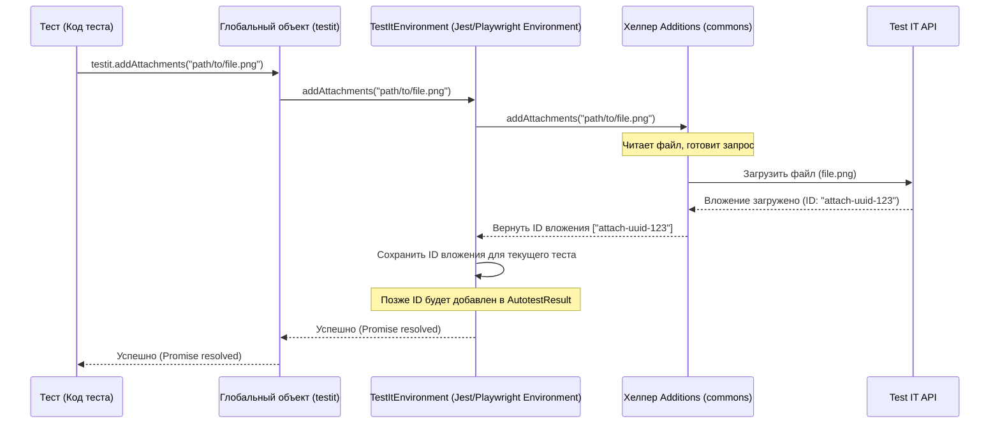

# Chapter 3: Вспомогательные Методы (Additions, Metadata, testit)


В [предыдущей главе](02_менеджер_конфигурации__configcomposer__.md) мы разобрались, как [Менеджер Конфигурации (ConfigComposer)](02_менеджер_конфигурации__configcomposer__.md) собирает все необходимые настройки для адаптера. Теперь, когда адаптер знает, *куда* и *как* отправлять результаты, давайте посмотрим, *что еще* полезного можно отправить в Test IT вместе с обычным статусом "пройден/упал".

Представьте, что ваш автотест проверяет сложный сценарий. Во время выполнения вы хотите:

*   Прикрепить скриншот ошибки.
*   Добавить ссылку на баг в трекере задач.
*   Оставить текстовое сообщение с деталями о сетевом запросе, который выполнялся в этот момент.
*   Связать этот автотест с конкретным тест-кейсом в Test IT.

Как передать всю эту дополнительную информацию? Для этого и существуют **Вспомогательные Методы**.

## Что такое Вспомогательные Методы?

Вспомогательные методы — это набор функций, предоставляемых адаптерами `adapters-js`, которые позволяют вам **обогащать ваши автотесты и их результаты** дополнительной информацией прямо из кода теста.

Их можно разделить на две большие группы:

1.  **Метаданные Автотеста (Metadata):** Это информация, которая описывает сам автотест как сущность в Test IT. Вы обычно задаете ее один раз для теста. Сюда входят:
    *   `externalId`: Уникальный идентификатор автотеста. Крайне важен для связи кода теста с тест-кейсом в Test IT.
    *   `displayName`: Имя автотеста, которое будет отображаться в Test IT.
    *   `workItemIds`: Массив идентификаторов тест-кейсов (ручных тестов) в Test IT, с которыми связан данный автотест.
    *   `title`: Заголовок в карточке автотеста.
    *   `description`: Описание в карточке автотеста.
    *   `labels`: Метки (теги) автотеста.
    *   `links`: Ссылки, связанные с самим автотестом (например, ссылка на документацию).
    *   `namespace`, `classname`: Помогают структурировать автотесты в Test IT по папкам.

2.  **Дополнения к Результату (Additions):** Это информация, которая относится к конкретному *запуску* вашего автотеста. Вы можете добавлять ее динамически во время выполнения теста. Сюда входят:
    *   `addMessage(message)`: Добавить текстовое сообщение к результату теста.
    *   `addLinks(links)`: Добавить одну или несколько ссылок к результату теста (например, ссылку на баг).
    *   `addAttachments(path/content, name?)`: Загрузить и прикрепить файл (например, скриншот, лог) к результату теста.

**Аналогия:**

Вспомните нашего исследователя из описания. Его основной отчет – это результат теста (пройден/упал). Но для полноты картины он использует:

*   **Блокнот (Метаданные):** Записывает основную информацию о тесте: его уникальный номер (`externalId`), название (`displayName`), какие пункты плана он проверяет (`workItemIds`), основные ссылки (`links`).
*   **Инструменты во время исследования (Дополнения):**
    *   **Диктофон (`addMessage`):** Записывает важные голосовые заметки по ходу дела.
    *   **Фотоаппарат (`addAttachments`):** Делает снимки (скриншоты, логи).
    *   **Дополнительные заметки (`addLinks`):** Записывает ссылки на конкретные находки (например, созданный баг).

Вся эта дополнительная информация прикрепляется к основному отчету, делая его гораздо более ценным.

## Как этим пользоваться?

Способ доступа к этим методам немного отличается в зависимости от тестового фреймворка:

*   **Jest / Playwright:** Используется глобальный объект `testit`.
*   **Mocha:** Используется контекст теста (`this`).
*   **Cucumber:** Методы добавляются в `World` контекст (`this`).
*   **TestCafe:** Методы вызываются через объект репортера (немного сложнее, но тоже возможно).
*   **CodeceptJS:** Используется хелпер (`I`).

Давайте посмотрим на примеры.

### Задание Метаданных (Metadata)

Метаданные помогают Test IT правильно идентифицировать и классифицировать ваш автотест. `externalId` — самый важный из них!

**Пример для Jest / Playwright (используя `testit`):**

```javascript
// my-test.spec.js
import { test } from "@playwright/test";
import { testit } from "testit-adapter-playwright"; // Импорт объекта testit

test('Проверка входа пользователя', async ({ page }) => {
    // Задаем метаданные ДО выполнения шагов теста
    testit.externalId('Login_Check_Successful'); // Уникальный ID (очень важно!)
    testit.displayName('Успешный вход пользователя'); // Имя в Test IT
    testit.workItemIds(['12345', '67890']); // Связь с ручными тест-кейсами
    testit.labels(['Дымовой', 'Вход']); // Метки
    testit.links([ // Ссылки на сам автотест
        { url: 'https://docs.example.com/login', title: 'Документация' }
    ]);
    testit.description('Этот тест проверяет сценарий успешного входа.'); // Описание

    // ... дальше идет логика самого теста ...
    await page.goto('/login');
    // ...
    expect(page.locator('#user-profile')).toBeVisible();
});
```

**Пример для Mocha (используя `this`):**

```javascript
// login.spec.js
import assert from "assert";
import { Context, Link } from "testit-adapter-mocha"; // Импорт типов

describe('Сценарии входа', function() {
    it('Успешный вход пользователя', function (this: Context) { // Указываем тип this
        // Задаем метаданные через this
        this.externalId = 'Login_Check_Successful';
        this.displayName = 'Успешный вход пользователя';
        this.workItemIds = ['12345', '67890'];
        this.labels = ['Дымовой', 'Вход'];
        this.links = [
            { url: 'https://docs.example.com/login', title: 'Документация' }
        ];
        this.description = 'Этот тест проверяет сценарий успешного входа.';

        // ... дальше идет логика самого теста ...
        const isLoggedIn = performLogin('user', 'password'); // Функция логина (пример)
        assert.strictEqual(isLoggedIn, true, 'Вход должен быть успешным');
    });
});
```

*   **Что произойдет в Test IT?** Когда результаты этого теста будут отправлены, Test IT найдет автотест с `externalId = 'Login_Check_Successful'` (или создаст новый, если включена опция `automaticCreationTestCases`). У этого автотеста в Test IT будут установлены указанные `displayName`, `description`, `labels`, `links` и связь с `workItemIds`.

### Добавление Результатов (Additions)

Эти методы вызываются *во время* выполнения теста, чтобы добавить контекст к конкретному результату.

**Пример для Jest / Playwright (используя `testit`):**

```javascript
// my-failing-test.spec.js
import { test, expect } from "@playwright/test";
import { testit } from "testit-adapter-playwright";
import { join } from "path"; // Для указания пути к файлу

test('Проверка отображения ошибки при неверном пароле', async ({ page }) => {
    testit.externalId('Login_Check_Bad_Password');
    testit.displayName('Неуспешный вход (неверный пароль)');

    await page.goto('/login');
    await page.fill('#username', 'user');
    await page.fill('#password', 'wrongpassword');
    await page.click('button[type="submit"]');

    const errorMessage = page.locator('.error-message');
    await expect(errorMessage).toBeVisible();

    // Добавляем дополнения к результату
    testit.addMessage('Проверяем сообщение об ошибке для пользователя user');
    testit.addLinks([ // Ссылка на баг в трекере
        { url: 'https://jira.example.com/browse/BUG-111', title: 'Баг BUG-111', type: 'Defect' }
    ]);

    // Прикрепляем скриншот
    const screenshotPath = join(__dirname, 'screenshots', 'login-error.png');
    await page.screenshot({ path: screenshotPath });
    await testit.addAttachment(screenshotPath); // Передаем путь к файлу

    // Можно также прикрепить текстовый контент напрямую
    const requestLog = "Request to /api/login failed with 401";
    await testit.addAttachment(requestLog, 'api-log.txt'); // Передаем контент и имя файла

    expect(await errorMessage.textContent()).toContain('Неверный пароль');
});
```

**Пример для Mocha (используя `this`):**

```javascript
// failing-login.spec.js
import assert from "assert";
import { Context } from "testit-adapter-mocha";
import { join } from "path";

describe('Сценарии входа', function() {
    it('Неуспешный вход (неверный пароль)', async function (this: Context) {
        this.externalId = 'Login_Check_Bad_Password';
        this.displayName = 'Неуспешный вход (неверный пароль)';

        const result = await performLogin('user', 'wrongpassword');
        const errorMessage = getErrorMessage(); // Функция для получения ошибки (пример)

        // Добавляем дополнения
        this.addMessage('Проверяем сообщение об ошибке для пользователя user');
        this.addLinks([
            { url: 'https://jira.example.com/browse/BUG-111', title: 'Баг BUG-111', type: 'Defect' }
        ]);

        // Прикрепляем скриншот (предполагается, что функция login сохраняет скриншот)
        const screenshotPath = join(__dirname, 'screenshots', 'login-error.png');
        // await simulateScreenshotSave(screenshotPath); // Добавление вложений
        await this.addAttachments(screenshotPath);

        // Прикрепляем текстовый лог
        const requestLog = "Request to /api/login failed with 401";
        await this.addAttachments(requestLog, 'api-log.txt');

        assert.strictEqual(result, false, 'Вход должен быть неуспешным');
        assert.ok(errorMessage.includes('Неверный пароль'), 'Должно быть сообщение об ошибке');
    });
});
```

**Пример для TestCafe (используя методы репортера):**

TestCafe немного отличается. Методы `addMessage`, `addLinks`, `addAttachments` вызываются не внутри теста, а передаются репортеру. Обычно создают вспомогательную функцию.

```javascript
// tmsHelper.js (Вспомогательный модуль)
import tmsReporter from 'testcafe-reporter-testit'; // Импортируем репортер

export default {
    addMessage: (t, message) => tmsReporter().addMessage(t, message),
    addLinks: (t, links) => tmsReporter().addLinks(t, links),
    addAttachments: (t, paths) => tmsReporter().addAttachments(t, paths),
};

// login.test.js (Сам тест)
import { Selector } from 'testcafe';
import tms from './tmsHelper'; // Импортируем наш хелпер
import { join } from 'path';

fixture `Сценарии входа`
    .page `http://localhost:8080/login`;

test('Неуспешный вход (неверный пароль)', async t => {
    // Метаданные задаются через .meta()
    await t.meta({
        externalId: 'Login_Check_Bad_Password',
        displayName: 'Неуспешный вход (неверный пароль)',
        workItemIds: ['12346']
    });

    await t
        .typeText('#username', 'user')
        .typeText('#password', 'wrongpassword')
        .click('button[type="submit"]');

    const errorMessage = Selector('.error-message');
    await t.expect(errorMessage.visible).ok();

    // Добавляем дополнения через хелпер, передавая ему объект 't'
    tms.addMessage(t, 'Проверяем сообщение об ошибке для пользователя user');
    tms.addLinks(t, [
        { url: 'https://jira.example.com/browse/BUG-111', title: 'Баг BUG-111', type: 'Defect' }
    ]);

    // Прикрепляем скриншот
    const screenshotPath = join(__dirname, 'screenshots', 'login-error.png');
    await t.takeScreenshot({ path: screenshotPath });
    tms.addAttachments(t, screenshotPath); // Передаем путь (или массив путей)

    await t.expect(errorMessage.innerText).contains('Неверный пароль');
});
```

*   **Что произойдет в Test IT?** В результатах выполнения этого конкретного теста (`Login_Check_Bad_Password`) в Test IT вы увидите:
    *   Добавленное сообщение в секции "Сообщение".
    *   Добавленные ссылки в секции "Ссылки".
    *   Прикрепленные файлы (скриншот, лог) в секции "Вложения".

## Как это работает "под капотом"?

Хотя синтаксис вызова отличается, общая идея похожа:

1.  **Сбор данных:** Когда вы вызываете метод вроде `testit.externalId(...)` или `this.addAttachments(...)`, адаптер (или его компоненты) сохраняет эту информацию.
    *   **Метаданные** обычно сохраняются в каком-то временном объекте, ассоциированном с текущим тестом (например, в `autotestData` в адаптере Jest).
    *   **Дополнения (Additions)** часто обрабатываются специальным хелпером `Additions` из [Общей Библиотеки (testit-js-commons)](04_общая_библиотека__testit_js_commons__.md). Например, при вызове `addAttachments`, этот хелпер может сразу загрузить файл через API Test IT и сохранить полученный ID вложения. Сообщения и ссылки просто накапливаются в массивах.

2.  **Формирование Payload:** Когда тест завершается, [Репортер/Форматтер Адаптера](01_репортер_форматтер_адаптера_.md) собирает все данные для отправки в Test IT. Он берет основные результаты (статус, время выполнения, ошибки) и добавляет к ним:
    *   Собранные **Метаданные** (externalId, displayName, workItemIds и т.д.). Эти данные пойдут в объект `AutotestPost`, который описывает сам автотест.
    *   Собранные **Дополнения** (ID загруженных вложений, массив сообщений, массив ссылок). Эти данные пойдут в объект `AutotestResult`, который описывает результат конкретного запуска.

3.  **Отправка:** Готовый payload с основной информацией, метаданными и дополнениями отправляется в Test IT с помощью [Стратегии Интеграции (IStrategy & StrategyFactory)](05_стратегия_интеграции__istrategy___strategyfactory_.md).

**Упрощенная диаграмма последовательности (для `addAttachments` в Jest/Playwright):**



**Ключевые фрагменты кода:**

*   **Обработка метаданных (Пример из `testit-adapter-jest/src/testitEnvironment.ts`):**
    Методы вроде `setExternalId` просто сохраняют значение в объект `autotestData`, который "живет" пока выполняется текущий тест.

    ```typescript
    // ... внутри класса TestItEnvironment ...
    private autotestData: AutotestData = emptyAutotestData(); // Хранилище метаданных

    setExternalId(id: string): void {
        log("Setting external id to %s", id);
        this.autotestData.externalId = id; // Просто сохраняем
    }

    setDisplayName(name: string): void {
        log("Setting display name to %s", name);
        this.autotestData.name = name; // Просто сохраняем
    }

    setWorkItems(workItems: string[]) {
        log("Setting work items to %s", this.autotestData.name);
        this.autotestData.workItemIds = workItems; // Просто сохраняем
    }

    // ... другие сеттеры метаданных ...

    // При сохранении результата, эти данные используются для создания AutotestPost
    async saveResult(/* ... */) {
        // ... сбор основных результатов ...
        const autotestPost: AutotestPost = {
            externalId: this.autotestData.externalId, // Используем сохраненный ID
            name: this.autotestData.name,           // Используем сохраненное имя
            workItemIds: this.autotestData.workItemIds, // Используем сохраненные workItems
            // ... другие метаданные из autotestData ...
            // ... шаги и т.д. ...
        };
        // ... отправка autotestPost и результата ...
        this.resetTest(); // Очищаем autotestData для следующего теста
    }
    ```

*   **Обработка дополнений (использование `Additions` хелпера):**
    Методы вроде `addAttachments` часто делегируют работу хелперу `Additions` из `testit-js-commons`.

    ```typescript
    // Пример из testit-adapter-jest/src/testitEnvironment.ts
    import { Additions } from "testit-js-commons"; // Импорт хелпера

    export default class TestItEnvironment extends NodeEnvironment {
      private readonly additions: Additions; // Экземпляр хелпера
      private attachmentsQueue: Promise<void>[] = []; // Очередь для ожидания загрузки

      constructor(/* ... */) {
        // ... настройка config ...
        this.additions = new Additions(config); // Создаем хелпер при инициализации
        this.global.testit = { // Регистрируем методы в глобальном объекте
          // ... другие методы ...
          addAttachments: this.addAttachments.bind(this), // Привязываем метод окружения
          addLinks: this.additions.addLinks.bind(this.additions), // Напрямую используем метод хелпера
          addMessage: this.additions.addMessage.bind(this.additions), // Напрямую используем метод хелпера
        };
      }

      // Метод обертка для addAttachments, использующий хелпер
      addAttachments(attachments: string[] | string, name?: string) {
        // ... (небольшая логика для сопоставления с шагами, если нужно)...

        // @ts-ignore Вызываем метод хелпера additions
        const promise = this.additions.addAttachments(attachments, name).then((ids) => {
            // Можно сохранить ID вложения в данные шага или теста, если нужно
            // ...
        });

        this.attachmentsQueue.push(promise); // Добавляем Promise загрузки в очередь ожидания
        return promise;
      }

      // При сохранении результата, используем накопленные данные из additions
      async saveResult(test: /* ... */) {
        await Promise.all(this.attachmentsQueue); // Ждем загрузки всех вложений!

        const result: AutotestResult = {
            // ...
            attachments: this.additions.attachments, // Берем ID вложений из хелпера
            message: this.additions.messages.join("\n"), // Берем сообщения из хелпера
            links: this.additions.links,             // Берем ссылки из хелпера
            // ...
        };

        this.autotests.push(this.autotestData);
        this.autotestResults.push(result);
        this.resetTest(); // Важно очистить и данные в хелпере additions
      }

      resetTest() {
          this.autotestData = emptyAutotestData();
          this.additions.clear(); // Вызываем очистку в хелпере
          this.currentType = undefined;
      }
      // ...
    }
    ```

*   **Хелпер `Additions` (из `testit-js-commons/src/helpers/additions/additions.helper.ts`):**
    Этот класс инкапсулирует логику хранения сообщений/ссылок и загрузки вложений.

    ```typescript
    // Упрощенный вид helpers/additions/additions.helper.ts
    import { Client, IClient } from "../../client"; // Клиент для API Test IT
    import { Link, Attachment, AdapterConfig } from "../../common";
    import { IAdditions } from "./additions.type";

    export class Additions implements IAdditions {
        public links: Link[] = [];       // Хранилище ссылок
        public attachments: Attachment[] = []; // Хранилище ID загруженных вложений
        public messages: string[] = []; // Хранилище сообщений
        private client: IClient;       // Клиент API

        constructor(config: AdapterConfig) {
            this.client = new Client(config); // Создаем API клиент
        }

        // Метод для загрузки вложений
        async addAttachments(pathsOrContent: string[] | string | Buffer, fileName?: string): Promise<Attachment[]> {
            const ids = Array.isArray(pathsOrContent)
                // Вызываем метод клиента API для загрузки файлов по путям
                ? await this.client.attachments.uploadAttachments(pathsOrContent)
                // Или метод для загрузки контента как файла
                : await this.client.attachments.uploadTextAttachment(pathsOrContent, fileName);

            this.attachments.push(...ids); // Сохраняем полученные ID

            return ids;
        }

        // Метод для добавления ссылок
        addLinks(links: Link | Link[]): void {
            Array.isArray(links) ? this.links.push(...links) : this.links.push(links); // Просто добавляем в массив
        }

        // Метод для добавления сообщений
        addMessage(message: string): void {
            this.messages.push(message); // Просто добавляем в массив
        }

        // Метод для очистки состояния между тестами
        clear() {
            this.attachments = [];
            this.messages = [];
            this.links = [];
        }
    }
    ```

Таким образом, вспомогательные методы предоставляют удобный интерфейс в вашем тестовом коде, а "под капотом" работают [Репортер/Форматтер](01_репортер_форматтер_адаптера_.md) и хелперы из [Общей Библиотеки (testit-js-commons)](04_общая_библиотека__testit_js_commons__.md) для сбора, обработки (например, загрузки файлов) и включения этой информации в итоговые данные, отправляемые в Test IT.

## Заключение

Вспомогательные методы — это мощный инструмент для повышения информативности ваших автотестов в Test IT. Они позволяют не просто видеть статус "пройден/упал", но и связывать тесты с требованиями (`workItemIds`), предоставлять детальное описание (`description`, `title`), прикреплять доказательства выполнения или причины падения (`addAttachments`, `addMessage`) и указывать на связанные ресурсы или дефекты (`addLinks`).

Использование этих методов делает отчеты в Test IT гораздо более полезными для анализа и отладки.

В следующей главе мы подробнее рассмотрим [Общую Библиотеку (testit-js-commons)](04_общая_библиотека__testit_js_commons__.md), которая лежит в основе всех адаптеров и предоставляет общие компоненты, такие как упомянутый хелпер `Additions`, API клиент, менеджер конфигурации и стратегии интеграции.

---

Generated by [AI Codebase Knowledge Builder](https://github.com/The-Pocket/Tutorial-Codebase-Knowledge)