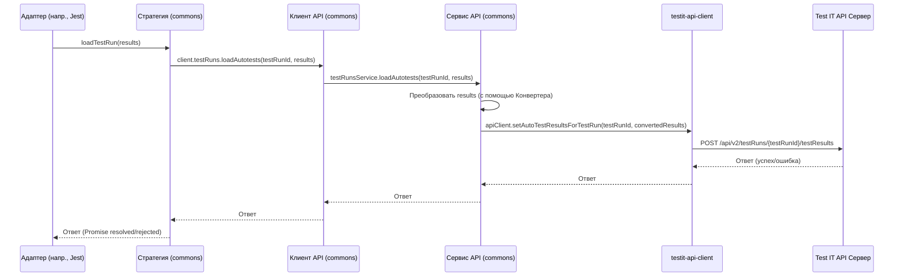

# Chapter 4: Общая Библиотека (testit-js-commons)


В [предыдущей главе](03_вспомогательные_методы__additions__metadata__testit__.md) мы узнали, как с помощью [Вспомогательных Методов](03_вспомогательные_методы__additions__metadata__testit__.md) обогащать наши тесты дополнительной информацией вроде ссылок, вложений и метаданных. Вы могли заметить, что реализация таких методов (например, загрузка вложений через API) должна быть одинаковой для всех адаптеров – будь то Jest, Playwright или Cucumber. Как же избежать дублирования этого кода в каждом адаптере?

Именно для этого и существует **Общая Библиотека (testit-js-commons)**.

## Зачем нужна общая библиотека?

Представьте, что вы — разработчик, которому нужно интегрировать Test IT с несколькими фреймворками: Jest, Playwright, Mocha, Cucumber. Для каждого фреймворка вы создаете свой адаптер ([Репортер/Форматтер](01_репортер_форматтер_адаптера_.md)).

Что будет нужно каждому адаптеру?

1.  Читаьб конфигурацию (URL Test IT, токен, ID проекта) из файлов и переменных окружения.
2.  Взаимодействовать с Test IT API для отправки результатов, создания автотестов, загрузки файлов.
3.  Преобразовывать данные из формата фреймворка в формат, понятный Test IT API.
4.  Работать с общими типами данных (как выглядит ссылка, результат теста, вложение).
5.  Использовать общие вспомогательные функции (например, для работы с файлами или генерации ID).

Если бы не было общей библиотеки, вам пришлось бы копировать и вставлять один и тот же код для чтения конфигурации, вызовов API, преобразования данных в каждый адаптер. Это привело бы к множеству проблем:

*   **Дублирование кода:** Много одинакового кода = сложно поддерживать.
*   **Несогласованность:** Исправив ошибку в одном адаптере, легко забыть исправить ее в других.
*   **Медленная разработка:** Приходится делать одну и ту же работу несколько раз.

**Общая Библиотека `testit-js-commons` решает эту проблему**, предоставляя единый набор инструментов и логики, который используется *всеми* адаптерами.

## Что такое `testit-js-commons`?

`testit-js-commons` — это npm-пакет, который является сердцем всего проекта `adapters-js`. Это фундамент, на котором строятся все остальные адаптеры для конкретных фреймворков.

Его основные задачи:

1.  **Предоставить ядро для взаимодействия с Test IT API:** Содержит классы-сервисы для работы с автотестами, тест-ранами, вложениями ([Сервисы API](07_сервисы_api__autotestsservice__testrunsservice__attachmentsservice__.md)).
2.  **Централизовать управление конфигурацией:** Включает [Менеджер Конфигурации (ConfigComposer)](02_менеджер_конфигурации__configcomposer__.md) для считывания и объединения настроек.
3.  **Определить стратегии интеграции:** Предлагает [Стратегию Интеграции (IStrategy & StrategyFactory)](05_стратегия_интеграции__istrategy___strategyfactory__.md) для разных режимов работы адаптера.
4.  **Реализовать конвертацию данных:** Содержит базовые [Конвертеры Данных](06_конвертеры_данных_.md) для преобразования форматов.
5.  **Предложить вспомогательные инструменты:** Включает хелперы (например, для работы с вложениями, как мы видели в [главе 3](03_вспомогательные_методы__additions__metadata__testit__.md)) и утилиты (работа с файлами, хеширование).
6.  **Определить общие типы данных:** Задает стандартные интерфейсы TypeScript (`Link`, `Outcome`, `AdapterConfig`, `Step` и т.д.), обеспечивая единообразие во всех адаптерах.

**Аналогия:**

Представьте себе автозавод (`adapters-js`). Чтобы собирать разные модели автомобилей (адаптеры для Jest, Playwright, Cucumber), заводу нужен **центральный инструментальный цех (`testit-js-commons`)**. Этот цех предоставляет:

*   **Стандартные двигатели и трансмиссии:** Общая логика API и стратегии интеграции.
*   **Инструменты для сборки:** Менеджер конфигурации, хелперы, утилиты.
*   **Чертежи и спецификации:** Общие типы данных.
*   **Конвейерные модули:** Конвертеры данных.

Каждый сборочный цех (конкретный адаптер) берет эти стандартные компоненты и инструменты из центрального цеха (`testit-js-commons`) и использует их для сборки своей уникальной модели автомобиля, добавляя лишь специфичные для этой модели детали (логику взаимодействия с конкретным фреймворком).

## Как Адаптеры Используют `testit-js-commons`?

Адаптеры для конкретных фреймворков (например, `testit-adapter-jest`, `testcafe-reporter-testit`) устанавливают `testit-js-commons` как **зависимость** (dependency) в своем `package.json`.

```json
// Пример из package.json адаптера (например, testit-adapter-jest)
{
  "name": "testit-adapter-jest",
  // ... другие поля ...
  "dependencies": {
    // Адаптер ЗАВИСИТ от общей библиотеки
    "testit-js-commons": "^3.2.1-TMS-5.3",
    // ... другие зависимости ...
  }
}
```
Это означает, что при установке адаптера (`npm install testit-adapter-jest`) автоматически загрузится и `testit-js-commons`.

Затем адаптер импортирует и использует компоненты из `commons`. Вот **упрощенный** псевдо-код, показывающий типичный поток внутри адаптера:

```typescript
// Упрощенный пример внутри адаптера (например, testit-adapter-jest)

// 1. Импорт необходимых компонентов из 'testit-js-commons'
import {
    ConfigComposer,      // Для чтения конфигурации
    StrategyFactory,     // Для создания стратегии
    IStrategy,           // Интерфейс стратегии
    AutotestPost,        // Тип для данных автотеста
    AutotestResult,      // Тип для результата теста
    Additions            // Хелпер для сообщений/ссылок/вложений
    // ... другие нужные типы и хелперы ...
} from "testit-js-commons";

// 2. Инициализация: Получение конфигурации и создание стратегии
const configComposer = new ConfigComposer();
const optionsFromFramework = { /* ... опции из jest.config.js ... */ };
const finalConfig = configComposer.compose(optionsFromFramework); // Используем ConfigComposer из commons
const strategy: IStrategy = StrategyFactory.create(finalConfig); // Используем StrategyFactory из commons
const additions = new Additions(finalConfig); // Используем Additions из commons

// 3. Во время выполнения тестов: Сбор данных
let collectedAutotests: AutotestPost[] = [];
let collectedResults: AutotestResult[] = [];

function onTestFinished(testData: any) {
    // ... логика адаптера для извлечения данных из testData ...
    const autotest: AutotestPost = { /* ... метаданные автотеста ... */ };
    const result: AutotestResult = {
        // ... основные результаты (статус, ошибки) ...
        // Используем данные, собранные хелпером Additions из commons
        message: additions.messages.join('\n'),
        links: additions.links,
        attachments: additions.attachments
    };

    collectedAutotests.push(autotest);
    collectedResults.push(result);
    additions.clear(); // Очищаем хелпер для следующего теста
}

// 4. По завершении всех тестов: Отправка данных через стратегию
async function onRunFinished() {
    // Отправляем информацию об автотестах (если нужно создать/обновить)
    await Promise.all(
        collectedAutotests.map(autotest =>
            strategy.loadAutotest(autotest, /* isPassed? */ true) // Вызов метода стратегии из commons
        )
    );

    // Отправляем результаты выполнения
    await strategy.loadTestRun(collectedResults); // Вызов метода стратегии из commons

    // Завершаем работу стратегии (например, закрываем тест-ран)
    await strategy.teardown(); // Вызов метода стратегии из commons
}

// Глобальные методы для пользователя (используют хелпер Additions)
const testit = {
    addMessage: additions.addMessage.bind(additions),
    addLinks: additions.addLinks.bind(additions),
    addAttachments: additions.addAttachments.bind(additions),
    // ... другие методы для метаданных ...
};
```

Этот пример показывает, что адаптер делегирует большую часть работы компонентам из `testit-js-commons`:

*   Чтение конфигурации (`ConfigComposer`).
*   Выбор способа взаимодействия с Test IT (`StrategyFactory`, `IStrategy`).
*   Обработку вложений, ссылок, сообщений (`Additions`).
*   Неявно, через стратегию, используются API-клиент и сервисы из `commons`.

Адаптер фокусируется на своей **главной задаче**: взаимодействии с конкретным тестовым фреймворком для *сбора* информации, а всю остальную "грязную работу" по обработке и отправке данных берет на себя `testit-js-commons`.

## Ключевые Компоненты `testit-js-commons` (Краткий Обзор)

Давайте еще раз пробежимся по основным "инструментам" в нашем ящике `testit-js-commons` и где мы с ними уже встречались или встретимся:

*   **[Менеджер Конфигурации (ConfigComposer)](02_менеджер_конфигурации__configcomposer__.md):** Отвечает за сбор и объединение настроек из разных источников. Мы подробно рассмотрели его в [Главе 2](02_менеджер_конфигурации__configcomposer__.md). Находится в `src/helpers/config`.
*   **Хелперы (например, `Additions`):** Предоставляют удобные методы для добавления вложений, ссылок, сообщений. Мы видели `Additions` в действии при изучении [Вспомогательных Методов](03_вспомогательные_методы__additions__metadata__testit__.md) в [Главе 3](03_вспомогательные_методы__additions__metadata__testit__.md). Находятся в `src/helpers/additions`.
*   **[Стратегия Интеграции (IStrategy & StrategyFactory)](05_стратегия_интеграции__istrategy___strategyfactory__.md):** Определяет логику взаимодействия с Test IT в зависимости от режима адаптера (`adapterMode`). Создается с помощью `StrategyFactory`. Этому посвящен наш [следующий раздел, Глава 5](05_стратегия_интеграции__istrategy___strategyfactory__.md). Находятся в `src/strategy`.
*   **[Конвертеры Данных](06_конвертеры_данных_.md):** Помогают преобразовывать данные между форматом адаптеров и форматом Test IT API (например, статусы тестов `Passed` <-> `Passed`). Мы рассмотрим их подробнее в [Главе 6](06_конвертеры_данных_.md). Базовый конвертер находится в `src/common`, специфичные для API - в `src/services`.
*   **[Сервисы API (AutotestsService, TestRunsService, AttachmentsService)](07_сервисы_api__autotestsservice__testrunsservice__attachmentsservice__.md):** Низкоуровневые классы, которые непосредственно вызывают методы Test IT API с помощью сгенерированного клиента `testit-api-client`. Они используются внутри Стратегий и хелперов. Изучим их в [Главе 7](07_сервисы_api__autotestsservice__testrunsservice__attachmentsservice__.md). Находятся в `src/services`.
*   **API Клиент (`Client`):** Оболочка над сервисами API, предоставляющая единую точку доступа к ним. Находится в `src/client`.
*   **Общие Типы (`common/types`):** Определения интерфейсов TypeScript (`AdapterConfig`, `Link`, `Outcome`, `Step` и т.д.), используемые во всем проекте для обеспечения согласованности данных.
*   **Утилиты (`common/utils`):** Набор вспомогательных функций для общих задач, таких как работа с файловой системой, генерация хешей, создание временных файлов. Находятся в `src/common/utils`.

## Внутренняя Структура и Поток Данных

Хотя как пользователь адаптера вы напрямую с `testit-js-commons` не работаете, понимание его внутреннего устройства полезно.

**Структура папок (упрощенно):**

```
testit-js-commons/
└── src/
    ├── client/       # Клиент API (точка доступа к сервисам)
    ├── common/       # Общие типы, утилиты, базовый конвертер
    │   ├── types/    # Определения интерфейсов TypeScript
    │   └── utils/    # Вспомогательные функции
    ├── helpers/      # Высокоуровневые помощники (Config, Additions)
    │   ├── additions/
    │   └── config/
    ├── services/     # Классы для работы с конкретными API-эндпоинтами Test IT
    │   ├── attachments/
    │   ├── autotests/
    │   └── testruns/
    ├── strategy/     # Стратегии интеграции (Zero, First, Second) и фабрика
    ├── storage/      # (Менее используется) Хранилище для промежуточных данных
    └── index.ts      # Главный экспортирующий файл библиотеки
```

**Пример потока данных (Отправка результатов):**

Давайте проследим, что происходит "под капотом", когда адаптер вызывает `strategy.loadTestRun(results)`:

1.  **Адаптер:** Вызывает `strategy.loadTestRun(collectedResults)`.
2.  **Стратегия (в `commons/strategy`):** Объект `BaseStrategy` (или его наследник) получает массив `collectedResults`.
3.  **Стратегия:** Вызывает метод своего API клиента: `this.client.testRuns.loadAutotests(testRunId, collectedResults)`.
4.  **Клиент API (в `commons/client`):** Объект `Client` находит нужный сервис (`TestRunsService`) и вызывает его метод `loadAutotests(testRunId, collectedResults)`.
5.  **Сервис API (в `commons/services/testruns`):** `TestRunsService` получает данные. Он может использовать `TestRunConverter` для преобразования каждого `AutotestResult` в формат, ожидаемый API (`TestResultModel[]`).
6.  **Сервис API:** Вызывает соответствующий метод сгенерированного клиента `testit-api-client` (который является зависимостью `commons`), например, `this._apiClient.setAutoTestResultsForTestRun(testRunId, convertedResults)`.
7.  **`testit-api-client`:** Формирует и отправляет HTTP-запрос к Test IT API.
8.  **Test IT API:** Обрабатывает запрос, сохраняет результаты.
9.  **Ответ:** Ответ от API возвращается по цепочке обратно вплоть до адаптера (если это предусмотрено).

**Диаграмма последовательности (Упрощенная):**



**Примеры кода (очень упрощенные):**

*   **Фабрика стратегий (`strategy/strategy.factory.ts`):**
    ```typescript
    // Файл: testit-js-commons/src/strategy/strategy.factory.ts
    import { AdapterConfig, AdapterMode } from "../common";
    import { IStrategy } from "./strategy.type";
    import { ZeroStrategy, FirstStrategy, SecondStrategy } from "./"; // Импорт конкретных стратегий

    // Тип для функции, создающей стратегию
    type StrategyConstructor = () => IStrategy;

    export class StrategyFactory {
      public static create(config: AdapterConfig): IStrategy {
        // Карта режимов и конструкторов стратегий
        const strategies: Record<AdapterMode, StrategyConstructor> = {
          0: () => new ZeroStrategy(config), // Режим 0 -> ZeroStrategy
          1: () => new FirstStrategy(config),// Режим 1 -> FirstStrategy
          2: () => new SecondStrategy(config),// Режим 2 -> SecondStrategy
        };
        // ... проверка на неизвестный режим ...
        // Возвращаем экземпляр нужной стратегии
        return strategies[config.adapterMode ?? 0]();
      }
    }
    ```
    *Объяснение:* Фабрика смотрит на `adapterMode` в конфигурации и создает экземпляр соответствующего класса Стратегии (`ZeroStrategy`, `FirstStrategy` или `SecondStrategy`), передавая ему конфигурацию.

*   **Базовая стратегия (`strategy/base.strategy.ts`):**
    ```typescript
    // Файл: testit-js-commons/src/strategy/base.strategy.ts
    import { Client, IClient } from "../client"; // Используем API Клиент
    import { AdapterConfig } from "../common";
    import { AutotestPost, AutotestResult, TestRunId } from "../services";
    import { IStrategy } from "./strategy.type";

    export class BaseStrategy implements IStrategy {
      client: IClient; // Экземпляр API клиента
      testRunId: Promise<TestRunId>; // Promise с ID тест-рана

      protected constructor(protected config: AdapterConfig) {
        this.client = new Client(config); // Создаем клиент при инициализации
        this.testRunId = Promise.resolve(config.testRunId); // Получаем ID из конфига
      }

      // Метод загрузки результатов (делегирует клиенту)
      async loadTestRun(autotests: AutotestResult[]): Promise<void> {
        const id = await this.testRunId; // Получаем актуальный ID тест-рана
        // Вызываем метод клиента API для загрузки результатов
        return await this.client.testRuns.loadAutotests(id, autotests);
      }

      // Метод загрузки информации об автотесте (делегирует клиенту)
      async loadAutotest(autotest: AutotestPost, isPassed: boolean): Promise<void> {
          await this.client.autoTests.loadAutotest(autotest, isPassed);
          // ... (логика обновления связей с work items) ...
      }
      // ... методы setup, teardown ...
    }
    ```
    *Объяснение:* Базовая стратегия (от которой наследуются другие) содержит общую логику, такую как создание API клиента и вызов его методов (`loadTestRun`, `loadAutotest`).

*   **API Клиент (`client/client.ts`):**
    ```typescript
    // Файл: testit-js-commons/src/client/client.ts
    import { AdapterConfig } from "../common";
    import {
      AttachmentsService, // Импорт сервисов
      TestRunsService,
      AutotestsService,
      // ... интерфейсы сервисов ...
    } from "../services";
    import { IClient } from "./client.type";

    export class Client implements IClient {
      // Публичные свойства для доступа к каждому сервису
      public attachments: IAttachmentsService;
      public autoTests: IAutotestService;
      public testRuns: ITestRunsService;

      constructor(private readonly config: AdapterConfig) {
        // Создаем экземпляры всех сервисов при инициализации клиента
        this.attachments = new AttachmentsService(config);
        this.autoTests = new AutotestsService(config);
        this.testRuns = new TestRunsService(config);
      }
      // ... метод getConfig ...
    }
    ```
    *Объяснение:* Класс `Client` просто агрегирует экземпляры всех API сервисов (`AttachmentsService`, `AutotestsService`, `TestRunsService`), предоставляя единую точку доступа к ним.

*   **API Сервис (`services/testruns/testruns.service.ts`):**
    ```typescript
    // Файл: testit-js-commons/src/services/testruns/testruns.service.ts
    import { TestRunsApi, /* ... другие импорты API клиента ... */ } from "testit-api-client"; // Низкоуровневый API клиент
    import { AdapterConfig } from "../../common";
    import { BaseService } from "../base.service"; // Базовый класс сервиса
    import { ITestRunsService, AutotestResult } from "./testruns.type";
    import { TestRunConverter, ITestRunConverter } from "./testruns.converter"; // Конвертер данных

    export class TestRunsService extends BaseService implements ITestRunsService {
      protected _client: TestRunsApi; // Экземпляр низкоуровнего API клиента
      protected _converter: ITestRunConverter; // Экземпляр конвертера

      constructor(protected readonly config: AdapterConfig) {
        super(config);
        // Создаем экземпляр низкоуровневого клиента (из testit-api-client)
        this._client = new TestRunsApi(config.url);
        // Настраиваем авторизацию
        this._client.setApiKey(/* ... */, `PrivateToken ${config.privateToken}`);
        // Создаем конвертер
        this._converter = new TestRunConverter(config);
      }

      // Метод для загрузки результатов автотестов
      public async loadAutotests(testRunId: string, autotests: Array<AutotestResult>) {
         // Преобразуем каждый результат с помощью конвертера
        const autotestResults = autotests.map((test) =>
            this._converter.toOriginAutotestResult(test)
        );
        // Вызываем метод низкоуровневого клиента для отправки данных по API
        for(const autotestResult of autotestResults) {
           await this._client.setAutoTestResultsForTestRun(testRunId, [autotestResult]);
        }
      }
      // ... другие методы сервиса (createTestRun, startTestRun, etc.) ...
    }
    ```
    *Объяснение:* Сервис `TestRunsService` инкапсулирует логику работы с API тест-ранов. Он использует конвертер для подготовки данных и низкоуровневый `testit-api-client` для фактической отправки HTTP-запросов.

## Заключение

**Общая Библиотека (testit-js-commons)** — это незаменимый фундамент для всего проекта `adapters-js`. Она предоставляет централизованный набор инструментов, логики и типов данных, которые используются всеми адаптерами для конкретных фреймворков. Благодаря `testit-js-commons`, адаптеры могут сосредоточиться на своей основной задаче — интеграции с фреймворком, — в то время как общая библиотека берет на себя всю рутину по взаимодействию с Test IT, обеспечивая консистентность, надежность и упрощая разработку и поддержку.

В следующей главе мы углубимся в один из важнейших компонентов `testit-js-commons` — [Стратегию Интеграции (IStrategy & StrategyFactory)](05_стратегия_интеграции__istrategy___strategyfactory__.md), которая определяет, как именно адаптер будет взаимодействовать с Test IT в зависимости от настроек.

---

Generated by [AI Codebase Knowledge Builder](https://github.com/The-Pocket/Tutorial-Codebase-Knowledge)