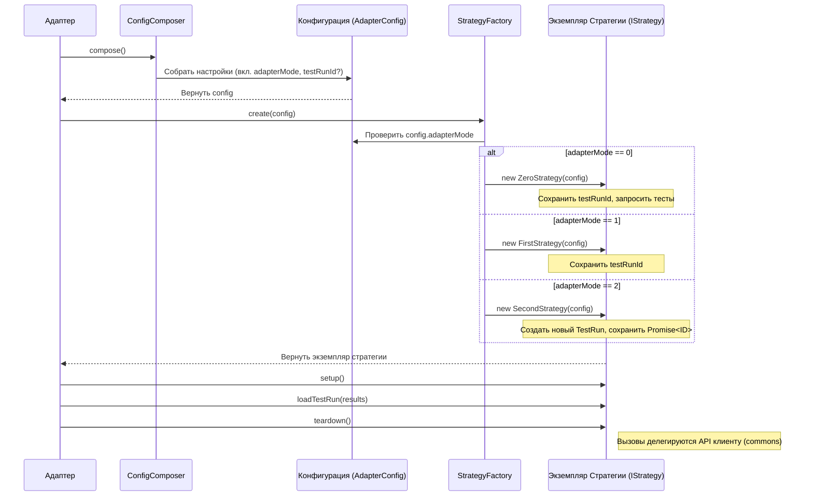

# Chapter 5: Стратегия Интеграции (IStrategy & StrategyFactory)


В [предыдущей главе](04_общая_библиотека__testit_js_commons__.md) мы познакомились с [Общей Библиотекой (testit-js-commons)](04_общая_библиотека__testit_js_commons__.md), которая служит фундаментом для всех адаптеров, предоставляя общие инструменты и логику. Одним из ключевых компонентов этой библиотеки является механизм **Стратегий Интеграции**. В этой главе мы разберемся, что это такое и зачем он нужен.

## Зачем нужна Стратегия Интеграции?

Представьте, что вы запустили свои автотесты. Теперь адаптеру нужно отправить результаты в Test IT. Но *как именно* он должен это сделать? Есть несколько вариантов:

1.  Может быть, вы хотите создать **совершенно новый Тест-ран** в Test IT для этого конкретного запуска?
2.  А может, у вас уже есть **существующий Тест-ран** (например, созданный вашей CI/CD системой), и вы просто хотите **добавить результаты** в него?
3.  Или, как во втором варианте, вы хотите **добавить результаты в существующий Тест-ран**, но перед этим нужно **сначала проверить**, какие тесты уже есть в этом Тест-ране, и отправлять только те, которые действительно нужно запустить (фильтрация)?

Как видите, способ взаимодействия с Test IT может отличаться в зависимости от вашей задачи. Адаптер должен уметь работать по-разному. **Стратегия Интеграции** — это механизм, который определяет, *какой именно* из этих сценариев (стратегий) будет использовать адаптер.

**Аналогия:**

Представьте себе службу доставки (наш адаптер). У курьера (стратегии) есть несколько способов выполнить заказ (отправить результаты):

1.  **Режим 2 (Новый маршрут):** Если это совершенно новый большой заказ, курьер создает для него отдельную, новую поездку (создает новый Тест-ран).
2.  **Режим 1 (Добавление к существующему маршруту):** Если у курьера уже есть запланированная поездка в ваш район, он просто добавляет вашу посылку к остальным (добавляет результаты в существующий Тест-ран без проверок).
3.  **Режим 0 (Добавление с проверкой):** Если курьер должен доставить только определенные типы посылок из уже существующего маршрута, он сначала проверяет список (фильтрует тесты в Тест-ране), а затем добавляет вашу посылку, если она соответствует требованиям (добавляет результаты в существующий Тест-ран с фильтрацией).

Какой именно "маршрут" выберет курьер, зависит от вашего "заказа" — то есть от конфигурации адаптера (`adapterMode`).

## Как это работает? Ключевые Концепции

В основе Стратегий Интеграции лежат три основных элемента:

1.  **Режим Адаптера (`adapterMode`):** Это настройка, которую вы можете указать в [конфигурации](02_менеджер_конфигурации__configcomposer__.md) (через файл `tms.config.json`, переменные окружения или прямые опции). Она сообщает адаптеру, по какой стратегии работать:
    *   `adapterMode: 0` (по умолчанию): Использовать существующий Тест-ран (нужен `testRunId` в конфиге) и перед отправкой результатов **проверять** (фильтровать) тесты, которые уже есть в этом Тест-ране.
    *   `adapterMode: 1`: Использовать существующий Тест-ран (нужен `testRunId` в конфиге), **не фильтровать** тесты, просто добавлять все результаты.
    *   `adapterMode: 2`: **Создать** новый Тест-ран (можно указать `testRunName`, `testRunId` не нужен), выполнить его и заполнить результатами.

2.  **Интерфейс Стратегии (`IStrategy`):** Это как "должностная инструкция" для любой стратегии. Она определяет, *что* должна уметь делать каждая стратегия:
    *   `setup()`: Выполнить подготовительные действия (например, запустить Тест-ран в Test IT, если он был создан).
    *   `loadAutotest(autotest, isPassed)`: Загрузить информацию о самом автотесте (его метаданные).
    *   `loadTestRun(results)`: Загрузить результаты выполнения тестов.
    *   `teardown()`: Выполнить завершающие действия (например, завершить Тест-ран в Test IT).
    *   `testRunId`: Предоставить ID Тест-рана, с которым идет работа.

3.  **Фабрика Стратегий (`StrategyFactory`):** Это "диспетчер", который смотрит на вашу настройку `adapterMode` и выбирает (создает) нужного "курьера" — конкретную реализацию стратегии (`ZeroStrategy`, `FirstStrategy` или `SecondStrategy`).

4.  **Конкретные Стратегии (`ZeroStrategy`, `FirstStrategy`, `SecondStrategy`):** Это классы, реализующие интерфейс `IStrategy` для каждого режима:
    *   `ZeroStrategy`: Реализует логику для `adapterMode: 0` (работа с существующим `testRunId`, получает список тестов для фильтрации).
    *   `FirstStrategy`: Реализует логику для `adapterMode: 1` (работа с существующим `testRunId`, без фильтрации).
    *   `SecondStrategy`: Реализует логику для `adapterMode: 2` (создает новый `testRunId`).

## Как это используется?

Как правило, вам, как пользователю, **не нужно напрямую** вызывать `StrategyFactory` или методы стратегий. [Репортер/Форматтер Адаптера](01_репортер_форматтер_адаптера_.md) для вашего фреймворка делает это за вас "под капотом".

Вот упрощенный пример, как это может выглядеть внутри адаптера (например, `testit-adapter-jest`):

```typescript
// Внутри кода адаптера (упрощенно)
import {
    ConfigComposer,
    StrategyFactory, // Импортируем Фабрику
    IStrategy       // Импортируем Интерфейс стратегии
} from "testit-js-commons"; // Из общей библиотеки

// 1. Получаем конфигурацию (включая adapterMode)
const configComposer = new ConfigComposer();
const config = configComposer.compose(); // ConfigComposer сам найдет adapterMode

// 2. Создаем нужную стратегию с помощью Фабрики
//    Фабрика сама посмотрит на config.adapterMode и вернет нужный объект
const strategy: IStrategy = StrategyFactory.create(config);

// 3. Адаптер использует созданную стратегию для отправки данных
async function sendResultsToTestIT(results: AutotestResult[]) {
    // Подготовка (может запустить тест-ран в Test IT, если режим 2)
    await strategy.setup();

    // Отправка результатов
    await strategy.loadTestRun(results);

    // Завершение (может завершить тест-ран в Test IT)
    await strategy.teardown();
}

// ... вызов sendResultsToTestIT() когда тесты завершены ...
```

**Что происходит?**

1.  Адаптер собирает конфигурацию с помощью [Менеджера Конфигурации (ConfigComposer)](02_менеджер_конфигурации__configcomposer__.md). `ConfigComposer` определяет значение `adapterMode` (например, из файла `tms.config.json`).
2.  Адаптер передает эту конфигурацию в `StrategyFactory.create()`.
3.  Фабрика смотрит на `config.adapterMode` и создает экземпляр нужной стратегии (например, `ZeroStrategy`, если `adapterMode` равен `0`).
4.  Адаптер получает этот конкретный объект стратегии и использует его методы (`setup`, `loadTestRun`, `teardown`) для взаимодействия с Test IT, не задумываясь о том, какая именно стратегия была выбрана. Вся логика, специфичная для режима, инкапсулирована внутри этой стратегии.

## Как это работает "под капотом"?

Давайте рассмотрим по шагам, что происходит при инициализации адаптера и выборе стратегии:

1.  **Чтение Конфигурации:** Адаптер запускает [ConfigComposer](02_менеджер_конфигурации__configcomposer__.md). `ConfigComposer` ищет настройки (`adapterMode`, `testRunId`, `url`, `projectId` и т.д.) в файлах, переменных окружения и т.д. и возвращает итоговый объект `config`.
2.  **Запрос Стратегии:** Адаптер вызывает `StrategyFactory.create(config)`.
3.  **Выбор в Фабрике:** `StrategyFactory` проверяет поле `config.adapterMode` (если оно не задано, используется `0` по умолчанию).
4.  **Создание Стратегии:**
    *   Если `adapterMode` равен `0`, фабрика создает `new ZeroStrategy(config)`. `ZeroStrategy` в своем конструкторе сохраняет `config.testRunId` и запрашивает у API список тестов для этого ID.
    *   Если `adapterMode` равен `1`, фабрика создает `new FirstStrategy(config)`. `FirstStrategy` просто сохраняет `config.testRunId`.
    *   Если `adapterMode` равен `2`, фабрика создает `new SecondStrategy(config)`. `SecondStrategy` в своем конструкторе *не* использует `config.testRunId`, а вместо этого вызывает API Test IT для *создания нового* Тест-рана и сохраняет *Promise* на его ID.
5.  **Возврат Стратегии:** Фабрика возвращает созданный экземпляр стратегии адаптеру.
6.  **Использование:** Адаптер работает с этим экземпляром через общий интерфейс `IStrategy`. Когда он вызывает, например, `strategy.loadTestRun()`, выполняется реализация этого метода из конкретного класса стратегии (Zero, First или Second).

**Диаграмма последовательности (Упрощенная):**



### Посмотрим на код

Компоненты стратегий находятся в [Общей Библиотеке (testit-js-commons)](04_общая_библиотека__testit_js_commons__.md) в папке `src/strategy`.

*   **Фабрика (`strategy/strategy.factory.ts`):**

```typescript
// Файл: testit-js-commons/src/strategy/strategy.factory.ts
import { AdapterConfig, AdapterMode } from "../common"; // Типы конфига и режима
import { IStrategy } from "./strategy.type"; // Интерфейс стратегии
// Импорт конкретных реализаций стратегий
import { ZeroStrategy, FirstStrategy, SecondStrategy } from "./";

// Тип для функции, создающей стратегию
type StrategyConstructor = () => IStrategy;

export class StrategyFactory {
  public static create(config: AdapterConfig): IStrategy {
    // Карта: Режим адаптера -> Функция для создания нужной стратегии
    const strategies: Record<AdapterMode, StrategyConstructor> = {
      0: () => new ZeroStrategy(config),   // Если режим 0, создаем ZeroStrategy
      1: () => new FirstStrategy(config),  // Если режим 1, создаем FirstStrategy
      2: () => new SecondStrategy(config), // Если режим 2, создаем SecondStrategy
    };

    // Проверка, что режим корректный (0, 1 или 2)
    if (config.adapterMode !== undefined && (config.adapterMode > 2 || config.adapterMode < 0)) {
      throw new Error("Неизвестный режим адаптера. Используйте 0, 1 или 2!");
    }

    // Выбираем нужную функцию из карты и вызываем ее, чтобы создать стратегию
    // Если config.adapterMode не задан, используем 0 по умолчанию
    return strategies[config.adapterMode ?? 0]();
  }
}
```

*Объяснение:* Фабрика использует объект `strategies` как карту. По значению `config.adapterMode` она находит соответствующую функцию, которая создает экземпляр нужного класса (`ZeroStrategy`, `FirstStrategy` или `SecondStrategy`), и возвращает его.

*   **Интерфейс Стратегии (`strategy/strategy.type.ts`):**

```typescript
// Файл: testit-js-commons/src/strategy/strategy.type.ts
import { AutotestPost, AutotestResult, AutotestResultGet, TestRunId } from "../services";

// Описывает, ЧТО должна уметь делать любая стратегия
export interface IStrategy {
  // Promise, который вернет ID Тест-рана (может быть сразу известен или получен после создания)
  readonly testRunId: Promise<TestRunId>;

  // Promise, который может вернуть тесты из существующего Тест-рана (для режима 0)
  readonly testsInRun?: Promise<AutotestResultGet[] | undefined>;

  // Подготовка к работе (например, старт Тест-рана)
  setup(): Promise<void>;
  // Завершение работы (например, завершение Тест-рана)
  teardown(): Promise<void>;

  // Загрузка информации об автотесте в Test IT
  loadAutotest(autotest: AutotestPost, isPassed: boolean): Promise<void>;
  // Загрузка результатов выполнения тестов в Test IT
  loadTestRun(autotests: AutotestResult[]): Promise<void>;
}
```

*Объяснение:* Этот интерфейс – контракт. Любой класс, который хочет быть стратегией, должен реализовать эти методы и свойства. Это позволяет Фабрике возвращать разные объекты, а адаптеру работать с ними одинаково.

*   **Базовая Стратегия (`strategy/base.strategy.ts`):** Содержит общую логику для всех стратегий.

```typescript
// Файл: testit-js-commons/src/strategy/base.strategy.ts
import { Client, IClient } from "../client"; // API Клиент из commons
import { AdapterConfig } from "../common";
import { AutotestPost, AutotestResult, TestRunId /*...*/ } from "../services"; // Типы данных
import { IStrategy } from "./strategy.type";

// Базовый класс, от которого наследуются Zero, First, Second
export class BaseStrategy implements IStrategy {
  client: IClient; // Экземпляр API клиента для вызовов Test IT
  testRunId: Promise<TestRunId>; // Promise с ID тест-рана

  // Конструктор базового класса
  protected constructor(protected config: AdapterConfig) {
    // Создаем API клиент при инициализации
    this.client = new Client(config);
    // По умолчанию берем ID из конфига (это переопределит SecondStrategy)
    this.testRunId = Promise.resolve(config.testRunId);
  }

  // Общий метод для загрузки результатов (используют все стратегии)
  async loadTestRun(autotests: AutotestResult[]): Promise<void> {
    const id = await this.testRunId; // Получаем актуальный ID тест-рана
    // Делегируем вызов API клиенту, который вызовет нужный [Сервис API](...)
    return await this.client.testRuns.loadAutotests(id, autotests);
  }

  // Общий метод для загрузки информации об автотесте
  async loadAutotest(autotest: AutotestPost, isPassed: boolean): Promise<void> {
    await this.client.autoTests.loadAutotest(autotest, isPassed);
    // ... (логика обновления связей с work items, если нужно) ...
  }

  // Общие методы setup/teardown (тоже делегируют API клиенту)
  async setup(): Promise<void> { /* ... вызывает client.testRuns.startTestRun ... */ }
  async teardown(): Promise<void> { /* ... вызывает client.testRuns.completeTestRun ... */ }
}
```

*Объяснение:* `BaseStrategy` содержит код, который нужен *всем* стратегиям: создание API клиента, общие реализации `loadTestRun`, `loadAutotest`, `setup`, `teardown`. Конкретные стратегии наследуют этот класс и могут переопределять или дополнять его поведение.

*   **Конкретные Стратегии (Конструкторы):**

```typescript
// Файл: testit-js-commons/src/strategy/zero.strategy.ts
import { BaseStrategy } from "./base.strategy";
// ...

export class ZeroStrategy extends BaseStrategy implements IStrategy {
  readonly testsInRun: Promise<AutotestResultGet[] | undefined>; // Для фильтрации

  constructor(config: AdapterConfig) {
    super(config); // Вызываем конструктор BaseStrategy
    // Проверяем, что testRunId задан (обязателен для режима 0)
    if (!config.testRunId) throw new Error("testRunId обязателен для режима 0");
    // Запрашиваем существующие тесты из тест-рана через API клиент
    this.testsInRun = this.client.testRuns.getAutotests(config.testRunId);
  }
}

// ---

// Файл: testit-js-commons/src/strategy/first.strategy.ts
import { BaseStrategy } from "./base.strategy";
// ...

export class FirstStrategy extends BaseStrategy implements IStrategy {
  constructor(config: AdapterConfig) {
    super(config); // Вызываем конструктор BaseStrategy
    // Просто проверяем, что testRunId задан (обязателен для режима 1)
    if (!config.testRunId) throw new Error("testRunId обязателен для режима 1");
    // ID тест-рана уже установлен в BaseStrategy из config.testRunId
  }
}

// ---

// Файл: testit-js-commons/src/strategy/second.strategy.ts
import { BaseStrategy } from "./base.strategy";
// ...

export class SecondStrategy extends BaseStrategy implements IStrategy {
  // Переопределяем testRunId из BaseStrategy
  testRunId: Promise<TestRunId>;

  constructor(config: AdapterConfig) {
    super(config); // Вызываем конструктор BaseStrategy
    // ! Самое главное: Создаем НОВЫЙ тест-ран через API клиент
    this.testRunId = this.client.testRuns.createTestRun(/* Можно передать testRunName из config */);
  }
}
```

*Объяснение:* Видно, как конструкторы конкретных стратегий реализуют логику, специфичную для их режима:
*   `ZeroStrategy` и `FirstStrategy` проверяют наличие `config.testRunId`. `ZeroStrategy` дополнительно загружает существующие тесты (`testsInRun`).
*   `SecondStrategy` *игнорирует* `config.testRunId` и вместо этого вызывает `this.client.testRuns.createTestRun()`, чтобы создать новый Тест-ран. Результатом `this.testRunId` становится *Promise*, который разрешится ID нового Тест-рана после его создания в Test IT.

## Заключение

Стратегия Интеграции (`IStrategy` и ее реализации `ZeroStrategy`, `FirstStrategy`, `SecondStrategy`) — это механизм из [Общей Библиотеки (testit-js-commons)](04_общая_библиотека__testit_js_commons__.md), который определяет, *как именно* адаптер будет взаимодействовать с Test IT при отправке результатов. Выбор конкретной стратегии происходит автоматически с помощью `StrategyFactory` на основе параметра `adapterMode` из вашей [конфигурации](02_менеджер_конфигурации__configcomposer__.md). Это позволяет гибко настраивать поведение адаптера: создавать ли новый Тест-ран, добавлять ли результаты в существующий, и нужно ли фильтровать тесты перед добавлением.

Стратегии используют [Сервисы API](07_сервисы_api__autotestsservice__testrunsservice__attachmentsservice__.md) для реального взаимодействия с Test IT. Но прежде чем данные попадут в API, их часто нужно преобразовать. В следующей главе мы рассмотрим [Конвертеры Данных](06_конвертеры_данных_.md), которые отвечают за это преобразование.

---

Generated by [AI Codebase Knowledge Builder](https://github.com/The-Pocket/Tutorial-Codebase-Knowledge)