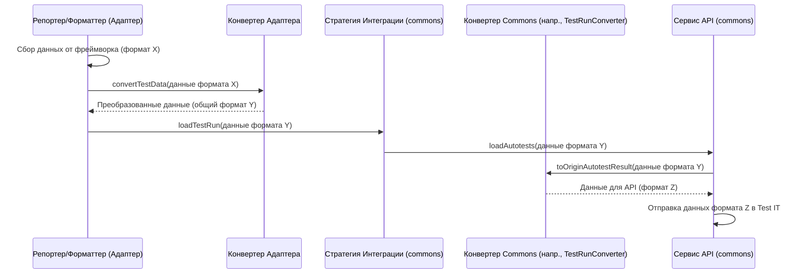

# Chapter 6: Конвертеры Данных


В [предыдущей главе](05_стратегия_интеграции__istrategy___strategyfactory_.md) мы узнали о [Стратегиях Интеграции](05_стратегия_интеграции__istrategy___strategyfactory_.md), которые определяют, *как* адаптер взаимодействует с Test IT (создает новый тест-ран или использует существующий). Теперь, когда мы знаем *как* отправлять данные, давайте разберемся, *что* нужно сделать с самими данными, чтобы Test IT их правильно понял.

## Зачем нужны Конвертеры Данных?

Представьте ситуацию: ваш тестовый фреймворк, например, TestCafe, по завершении теста сообщает, что тест `skipped` (пропущен). Другой фреймворк, скажем, Jest, может использовать статус `pending` для той же ситуации. А система Test IT ожидает получить статус в виде строки `"Skipped"`. Как быть?

Или еще пример: ваш фреймворк возвращает детальную информацию об ошибке в виде сложного объекта, а Test IT API ожидает получить сообщение об ошибке и трассировку стека (`stacktrace`) в виде простых строк в полях `message` и `traces`.

Вот тут-то и приходят на помощь **Конвертеры Данных**. Они нужны, чтобы "перевести" информацию с языка конкретного тестового фреймворка на язык, понятный Test IT API, и наоборот (хотя обратное преобразование используется реже).

## Что такое Конвертеры Данных?

**Конвертеры Данных** — это специальные функции или классы, которые отвечают за преобразование данных между форматом, используемым конкретным тестовым фреймворком (например, TestCafe, Jest, Playwright), и форматом, который ожидает API Test IT.

Их главная задача — действовать как **переводчики**:

1.  **Перевод статусов тестов:** Преобразуют статусы вроде `passed`, `failed`, `skipped`, `pending` в единый формат Test IT: `"Passed"`, `"Failed"`, `"Skipped"`.
2.  **Форматирование ошибок:** Извлекают сообщения и стектрейсы из объектов ошибок фреймворка и помещают их в нужные поля для Test IT.
3.  **Адаптация структуры данных:** Преобразуют шаги тестов, ссылки, метаданные (вроде `labels`, `workItemIds`) из структуры данных фреймворка в структуру объектов, которые принимает Test IT API.
4.  **Иногда обратное преобразование:** В редких случаях, например, при получении данных из Test IT, может потребоваться преобразовать их обратно в формат, понятный адаптеру.

**Аналогия:**

Представьте себе международную конференцию (взаимодействие адаптера и Test IT). На ней выступают докладчики из разных стран (тестовые фреймворки), говорящие на своих языках. Чтобы все участники (особенно принимающая сторона — Test IT) поняли друг друга, нужны **переводчики-синхронисты (Конвертеры Данных)**. Они слушают докладчика (тестовый фреймворк), мгновенно переводят его речь (данные) на официальный язык конференции (формат Test IT API) и передают ее слушателям (Test IT). Без этих переводчиков общение было бы невозможным.

## Как используются Конвертеры?

Обычно вам, как пользователю адаптера, **не нужно напрямую вызывать** конвертеры. Они работают "под капотом" и используются другими компонентами:

*   [Репортер/Форматтер Адаптера](01_репортер_форматтер_адаптера_.md): Прежде чем передать собранные данные о тесте дальше, репортер использует конвертер, чтобы привести их к общему формату.
*   [Стратегия Интеграции](05_стратегия_интеграции__istrategy___strategyfactory_.md) или [Сервисы API](07_сервисы_api__autotestsservice__testrunsservice__attachmentsservice__.md) (внутри `testit-js-commons`): Перед отправкой данных непосредственно в Test IT API, эти компоненты используют конвертеры для финального преобразования данных в формат, строго соответствующий API-контракту.

### Пример: Конвертация статуса в TestCafe

Давайте посмотрим на упрощенный пример конвертера из адаптера `testcafe-reporter-testit`. TestCafe предоставляет информацию о результате теста в объекте `testRunInfo`. Нам нужно преобразовать эту информацию в один из статусов: `Passed`, `Failed` или `Skipped`.

```typescript
// Упрощенный фрагмент из testcafe-reporter-testit/src/converter.ts

// Возможные статусы для Test IT
enum Status {
  PASSED = "Passed",
  FAILED = "Failed",
  SKIPPED = "Skipped",
}

// Тип для информации о запуске теста из TestCafe (упрощенно)
type TestRunInfo = {
  errs: any[];      // Массив ошибок
  skipped: boolean; // Флаг, что тест пропущен
  // ... другие поля
};

export class Converter {
  // Функция для преобразования статуса из TestCafe в статус Test IT
  static convertStatus(testRunInfo: TestRunInfo): Status {
    // Проверяем, есть ли ошибки
    const hasErrors = !!testRunInfo.errs && testRunInfo.errs.length > 0;
    // Проверяем, был ли тест пропущен
    const isSkipped = testRunInfo.skipped;

    if (isSkipped) {
      // Если пропущен, возвращаем "Skipped"
      return Status.SKIPPED;
    }
    if (hasErrors) {
      // Если были ошибки, возвращаем "Failed"
      return Status.FAILED;
    }
    // Если не пропущен и нет ошибок, значит "Passed"
    return Status.PASSED;
  }

  // ... другие методы конвертации (для ошибок, метаданных и т.д.)
}

// Как это может использоваться внутри репортера:
// const testStatusInTestIT = Converter.convertStatus(testCafeTestRunInfo);
// console.log(testStatusInTestIT); // Выведет "Passed", "Failed" или "Skipped"
```

*   **Объяснение:** Функция `convertStatus` принимает объект `testRunInfo` от TestCafe. Она проверяет два поля: `skipped` и `errs`. На основе этих проверок она возвращает одну из строк: `"Skipped"`, `"Failed"` или `"Passed"`, которые понятны для Test IT. [Репортер](01_репортер_форматтер_адаптера_.md) затем использует это значение при формировании объекта результата для отправки.

## Как это работает "под капотом"?

Процесс преобразования данных обычно выглядит так:

1.  **Сбор данных:** [Репортер/Форматтер](01_репортер_форматтер_адаптера_.md) собирает данные из событий тестового фреймворка в его "родном" формате.
2.  **Первичное преобразование (в адаптере):** Репортер может использовать *свой собственный* конвертер (специфичный для этого адаптера), чтобы преобразовать данные из формата фреймворка в более унифицированный формат, используемый внутри `adapters-js` (например, используя типы из `testit-js-commons`).
3.  **Передача в `commons`:** Адаптер передает эти унифицированные данные [Стратегии Интеграции](05_стратегия_интеграции__istrategy___strategyfactory_.md).
4.  **Финальное преобразование (в `commons`):** [Стратегия Интеграции](05_стратегия_интеграции__istrategy___strategyfactory_.md) или вызываемые ею [Сервисы API](07_сервисы_api__autotestsservice__testrunsservice__attachmentsservice__.md) используют *свои* конвертеры (из `testit-js-commons`), чтобы преобразовать унифицированные данные в точный формат, который ожидает конкретный метод Test IT API.
5.  **Отправка запроса:** [Сервис API](07_сервисы_api__autotestsservice__testrunsservice__attachmentsservice__.md) отправляет преобразованные данные в Test IT.

**Упрощенная диаграмма последовательности:**



### Конвертеры в `testit-js-commons`

[Общая Библиотека (testit-js-commons)](04_общая_библиотека__testit_js_commons__.md) содержит конвертеры, которые переводят данные из общих типов `adapters-js` (например, `Outcome`, `Link`) в типы, используемые сгенерированным API клиентом (`testit-api-client`).

*   **Базовый Конвертер (`BaseConverter`):** Содержит общие функции преобразования, например, для статусов (`Outcome`) или типов ссылок (`LinkType`).

```typescript
// Упрощенный фрагмент из testit-js-commons/src/common/base.converter.ts

// Импорт типа статуса из сгенерированного API клиента
import { AvailableTestResultOutcome } from "testit-api-client";
// Импорт общего типа статуса из adapters-js
import { Outcome } from "./types";

export class BaseConverter {
  // ...

  // Преобразует наш общий статус (напр., "Passed")
  // в статус, понятный API клиенту (напр., AvailableTestResultOutcome.Passed)
  toOriginOutcome(outcome: Outcome): AvailableTestResultOutcome {
    // Использует перечисление (enum) из API клиента для преобразования
    return AvailableTestResultOutcome[outcome];
  }

  // ... другие базовые преобразования (для ссылок и т.д.) ...
}
```

*   **Объяснение:** Метод `toOriginOutcome` берет строковое значение статуса (`"Passed"`, `"Failed"`, `"Skipped"`) и возвращает соответствующее значение из перечисления `AvailableTestResultOutcome`, которое используется библиотекой `testit-api-client` для отправки запросов.

*   **Конвертер для Тест-ранов (`TestRunConverter`):** Использует `BaseConverter` и преобразует весь объект результата теста (`AutotestResult`) в формат, ожидаемый API для загрузки результатов (`AutoTestResultsForTestRunModel`).

```typescript
// Упрощенный фрагмент из testit-js-commons/src/services/testruns/testruns.converter.ts

// Импорт типа результата для API
import { AutoTestResultsForTestRunModel } from "testit-api-client";
// Импорт базового конвертера
import { BaseConverter } from "../../common";
// Импорт наших общих типов
import { AdapterConfig, AutotestResult } from "../../common";
// ...

export class TestRunConverter extends BaseConverter {
  // ...

  // Преобразует наш объект AutotestResult в формат для API
  toOriginAutotestResult(autotest: AutotestResult): AutoTestResultsForTestRunModel {
    return {
      // Некоторые поля копируются напрямую
      configurationId: this.config.configurationId,
      autoTestExternalId: autotest.autoTestExternalId,
      message: autotest.message,
      traces: autotest.traces,
      duration: autotest.duration,
      // ... другие поля ...

      // Статус преобразуется с помощью метода базового конвертера
      outcome: this.toOriginOutcome(autotest.outcome),

      // Ссылки преобразуются (тоже может использовать BaseConverter)
      links: autotest.links?.map((link) => this.toOriginLink(link)),

      // Шаги преобразуются рекурсивно (тоже может использовать BaseConverter)
      stepResults: autotest.stepResults?.map((step) => this.toOriginStep(step)),
      // ... setups/teardowns ...

      // ID вложений просто передаются (предполагается, что они уже загружены)
      attachments: autotest.attachments,
      // ... и т.д.
    };
  }

  // ... другие методы конвертации для тест-ранов ...
}
```

*   **Объяснение:** Метод `toOriginAutotestResult` принимает наш внутренний объект `AutotestResult`. Он создает новый объект `AutoTestResultsForTestRunModel`, копируя некоторые поля напрямую, а для других (как `outcome`, `links`, `stepResults`) вызывает соответствующие методы `BaseConverter` (или свои собственные) для преобразования в формат API. Этот итоговый объект затем передается в [Сервис API](07_сервисы_api__autotestsservice__testrunsservice__attachmentsservice__.md) для отправки.

### Конвертеры в Адаптерах

Как упоминалось, адаптеры для конкретных фреймворков часто содержат свои собственные конвертеры для "первого шага" преобразования — из специфичного формата фреймворка в общие типы `adapters-js`. Пример `Converter.convertStatus` из TestCafe выше как раз иллюстрирует этот тип конвертера. Другие адаптеры (Jest, Playwright, Cucumber) имеют схожие конвертеры для своих форматов данных.

## Заключение

Конвертеры Данных играют незаметную, но крайне важную роль в работе адаптеров `adapters-js`. Они выступают в роли "переводчиков", обеспечивая преобразование данных между различными форматами: специфичным для тестового фреймворка, внутренним унифицированным форматом `adapters-js` и строгим форматом, требуемым Test IT API. Благодаря конвертерам, информация о статусах, ошибках, шагах, ссылках и метаданных передается корректно, обеспечивая точное отображение результатов ваших тестов в Test IT.

Конвертеры подготавливают данные для их финальной отправки. В следующей главе мы рассмотрим компоненты, которые непосредственно отвечают за эту отправку - [Сервисы API (AutotestsService, TestRunsService, AttachmentsService)](07_сервисы_api__autotestsservice__testrunsservice__attachmentsservice__.md).

---

Generated by [AI Codebase Knowledge Builder](https://github.com/The-Pocket/Tutorial-Codebase-Knowledge)