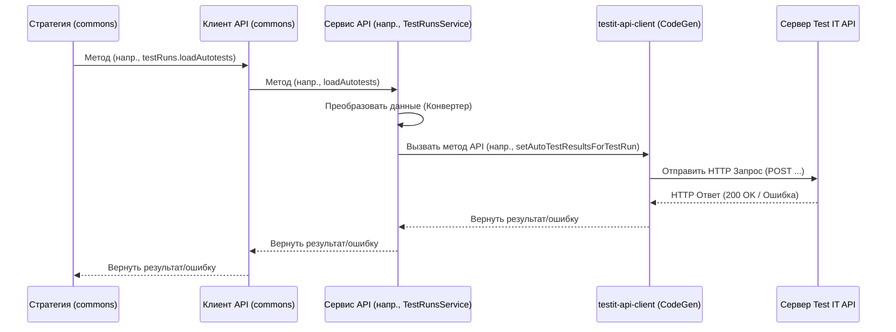

# Chapter 7: Сервисы API (AutotestsService, TestRunsService, AttachmentsService)


В [предыдущей главе](06_конвертеры_данных_.md) мы узнали, как [Конвертеры Данных](06_конвертеры_данных_.md) помогают подготовить и "перевести" информацию из вашего тестового фреймворка в формат, понятный для Test IT. Конвертеры приводят данные к единому виду, но кто же на самом деле берет эти готовые данные и отправляет Mх по сети на сервер Test IT?

Именно для этой финальной задачи существуют **Сервисы API**.

## Зачем нужны Сервисы API?

Представьте, что адаптер собрал все результаты тестов, сконвертировал их в нужный формат. Теперь ему нужно выполнить конкретные действия в Test IT:

*   Создать новый автотест.
*   Обновить информацию о существующем автотесте.
*   Загрузить файл с логом или скриншотом.
*   Отправить результаты выполнения для конкретного тест-рана.
*   Создать или завершить тест-ран.

Все эти действия требуют прямого обращения к API (Application Programming Interface) системы Test IT. API — это как набор правил и команд, которые сервер Test IT понимает. Нам нужны специальные инструменты, которые умеют "разговаривать" с сервером Test IT на этом языке API.

Этими инструментами и являются **Сервисы API**: `AutotestsService`, `TestRunsService` и `AttachmentsService`.

## Что такое Сервисы API?

**Сервисы API** — это классы внутри [Общей Библиотеки (testit-js-commons)](04_общая_библиотека__testit_js_commons__.md), которые отвечают за непосредственное взаимодействие с различными группами команд (эндпоинтов) API Test IT.

Каждый сервис специализируется на своей области:

1.  **`AutotestsService`:** Работает со всем, что касается автотестов. Его задачи — найти существующий автотест, создать новый, обновить его данные (имя, описание, шаги, связи с тест-кейсами).
2.  **`TestRunsService`:** Управляет жизненным циклом тест-ранов. Он умеет создавать новые тест-раны, запускать их (`start`), завершать (`complete`) и, самое главное, загружать в них результаты выполненных автотестов.
3.  **`AttachmentsService`:** Занимается только одной, но важной задачей — загрузкой файлов (вложений) на сервер Test IT. Он принимает файл (или его содержимое) и отправляет его, получая в ответ уникальный идентификатор (ID) загруженного вложения.

**Аналогия:**

Продолжим аналогию с компанией из описания концепции. Представьте себе большую организацию (Test IT).

*   **`AutotestsService`** — это как отдел технической документации. Он отвечает за создание, обновление и хранение описаний всех "продуктов" (автотестов).
*   **`TestRunsService`** — это отдел планирования и контроля проектов. Он создает планы выполнения работ (тест-раны), запускает их в исполнение и фиксирует итоговые результаты по каждому пункту плана.
*   **`AttachmentsService`** — это архивный отдел или курьерская служба. Его задача — принять сопроводительные материалы (логи, скриншоты) и надежно доставить их в архив Test IT, присвоив каждому уникальный номер.

Эти "отделы" (сервисы) являются исполнителями низкого уровня. Обычно им дают указания "менеджеры" более высокого уровня (например, [Стратегии Интеграции](05_стратегия_интеграции__istrategy___strategyfactory_.md)).

## Как они используются? (Взгляд изнутри)

Важно понимать: вы, как пользователь адаптера, **почти никогда не будете вызывать эти сервисы API напрямую** из кода своих тестов. Они предназначены для использования *внутренними* компонентами `adapters-js`.

Кто же их использует?

*   **[Стратегия Интеграции (IStrategy & StrategyFactory)](05_стратегия_интеграции__istrategy___strategyfactory_.md):** Когда стратегия должна, например, создать тест-ран (в режиме `adapterMode: 2`), она вызывает метод `createTestRun()` у сервиса `TestRunsService`. Когда нужно загрузить результаты, она вызывает `loadAutotests()` у того же `TestRunsService`. Для загрузки информации об автотесте используется `loadAutotest()` у `AutotestsService`.
*   **Хелпер `Additions` (из [Вспомогательных Методов](03_вспомогательные_методы__additions__metadata__testit__.md)):** Когда вы в своем тесте вызываете `testit.addAttachment("screenshot.png")`, хелпер `Additions` внутри себя обращается к `AttachmentsService`, чтобы реально загрузить этот файл в Test IT.

**Концептуальный пример (где сервисы вызываются внутри `testit-js-commons`):**

Допустим, мы смотрим внутрь метода `loadTestRun` какой-нибудь [Стратегии Интеграции](05_стратегия_интеграции__istrategy___strategyfactory_.md):

```typescript
// Упрощенный пример внутри BaseStrategy (testit-js-commons/src/strategy/base.strategy.ts)
import { Client, IClient } from "../client"; // Клиент API, который содержит сервисы
import { AutotestResult } from "../services"; // Тип результата
// ...

export class BaseStrategy /* ... */ {
  client: IClient; // Экземпляр клиента, который хранит ссылки на сервисы
  // ...

  // Метод для загрузки результатов
  async loadTestRun(autotests: AutotestResult[]): Promise<void> {
    const id = await this.testRunId; // Получаем ID тест-рана

    // Вот здесь! Стратегия вызывает метод сервиса TestRunsService через клиент API
    // Внутренний 'клиент' содержит поле 'testRuns', которое является экземпляром TestRunsService
    return await this.client.testRuns.loadAutotests(id, autotests);
  }
  // ...
}
```

*   **Что происходит?** Стратегия `BaseStrategy` имеет доступ к объекту `client` (типа `IClient`). Этот клиент — это центральный "шлюз" ко всем сервисам API. Когда нужно загрузить результаты, стратегия просто вызывает `client.testRuns.loadAutotests(...)`. Сам объект `client` перенаправит этот вызов к реальному методу `loadAutotests` у экземпляра `TestRunsService`.

## Как это работает "под капотом"?

Давайте проследим путь данных еще глубже, когда, например, вызывается загрузка результатов.

1.  **Вызов Стратегии:** Адаптер вызывает `strategy.loadTestRun(results)`.
2.  **Вызов Клиента:** Стратегия (внутри `strategy/base.strategy.ts`) вызывает `this.client.testRuns.loadAutotests(testRunId, results)`.
3.  **Клиент Перенаправляет:** Клиент API (`client/client.ts`) находит нужный сервис (экземпляр `TestRunsService`) и вызывает его метод `loadAutotests(testRunId, results)`.
4.  **Работа Сервиса:** `TestRunsService` (`services/testruns/testruns.service.ts`) получает данные.
    *   Он использует [Конвертер Данных](06_конвертеры_данных_.md) (`TestRunConverter`), чтобы преобразовать `results` в формат, точно соответствующий модели данных для API Test IT.
    *   Он использует низкоуровневую библиотеку `testit-api-client` (которая генерируется автоматически из спецификации Test IT API) для формирования и отправки HTTP-запроса к нужному эндпоинту (например, `POST /api/v2/testRuns/{testRunId}/testResults`).
5.  **API Test IT:** Сервер Test IT получает запрос, обрабатывает его и сохраняет результаты.
6.  **Ответ:** Ответ от сервера (успех или ошибка) возвращается по цепочке обратно.

**Упрщенная диаграмма последовательности:**



### Погружение в код `testit-js-commons`

Сервисы API находятся в папке `src/services` внутри `testit-js-commons`, с подпапками для каждого сервиса (`autotests`, `attachments`, `testruns`).

*   **Клиент API (`client/client.ts`): Шлюз к сервисам**

```typescript
// Файл: testit-js-commons/src/client/client.ts
import { AdapterConfig } from "../common";
import {
  AttachmentsService, // Импорт самих классов сервисов
  TestRunsService,
  AutotestsService,
  // ... импорт интерфейсов сервисов (IAttachmentsService и т.д.) ...
} from "../services";
import { IClient } from "./client.type"; // Интерфейс клиента

export class Client implements IClient {
  // Публичные поля для доступа к каждому сервису
  public attachments: IAttachmentsService;
  public autoTests: IAutotestService;
  public testRuns: ITestRunsService;

  // Конструктор клиента
  constructor(private readonly config: AdapterConfig) {
    // При создании клиента создаются экземпляры всех сервисов
    this.attachments = new AttachmentsService(config);
    this.autoTests = new AutotestsService(config);
    this.testRuns = new TestRunsService(config);
  }
  // ...
}
```

*   **Объяснение:** Класс `Client` — это фасад. Он просто создает и хранит экземпляры всех сервисов (`AttachmentsService`, `AutotestsService`, `TestRunsService`), передавая им конфигурацию. [Стратегия Интеграции](05_стратегия_интеграции__istrategy___strategyfactory_.md) получает экземпляр этого `Client` и через него обращается к нужному сервису (например, `client.attachments.uploadAttachments(...)`).

*   **Пример: `AttachmentsService` (`services/attachments/attachments.service.ts`):**

```typescript
// Файл: testit-js-commons/src/services/attachments/attachments.service.ts
import { AttachmentsApi /* ... */ } from "testit-api-client"; // Импорт из сгенерированного клиента
import { Utils, AdapterConfig, Attachment } from "../../common"; // Утилиты, типы
import { BaseService } from "../base.service"; // Базовый класс сервиса
// ...

export class AttachmentsService extends BaseService implements IAttachmentsService {
  protected _client: AttachmentsApi; // Экземпляр низкоуровневого клиента

  constructor(protected readonly config: AdapterConfig) {
    super(config); // Вызов конструктора базового класса
    // Создаем экземпляр API клиента для работы с вложениями
    this._client = new AttachmentsApi(config.url);
    // Настраиваем авторизацию (передаем Private Token)
    this._client.setApiKey(/*...*/, `PrivateToken ${config.privateToken}`);
  }

  // Метод для загрузки файлов по их путям
  public async uploadAttachments(paths: string[]): Promise<Attachment[]> {
    // Используем Promise.all для параллельной загрузки
    return await Promise.all(
      paths.map((path) => {
        // Вызываем метод низкоуровневого клиента _client.apiV2AttachmentsPost
        // Utils.readStream читает файл как поток данных
        return this._client
          .apiV2AttachmentsPost(Utils.readStream(path), /* ... опции ... */)
          // Обрабатываем успешный ответ: извлекаем ID и возвращаем его
          .then(({ body }) => ({ id: body.id }));
      })
    );
  }
  // ... метод uploadTextAttachment для загрузки текстового контента ...
}
```

*   **Объяснение:** `AttachmentsService` отвечает за загрузку файлов. Он использует сгенерированный `AttachmentsApi` из `testit-api-client`. Метод `uploadAttachments` читает файлы по указанным путям и для каждого вызывает `_client.apiV2AttachmentsPost`, который отправляет HTTP POST запрос с файлом на сервер Test IT. Сервис возвращает массив объектов с ID загруженных файлов.

*   **Пример: `TestRunsService` (`services/testruns/testruns.service.ts`):**

```typescript
// Файл: testit-js-commons/src/services/testruns/testruns.service.ts
import { TestRunsApi /* ... */ } from "testit-api-client"; // API клиент для тест-ранов
import { AdapterConfig } from "../../common";
import { BaseService } from "../base.service";
import { AutotestResult /*...*/ } from "./testruns.type";
import { TestRunConverter, ITestRunConverter } from "./testruns.converter"; // Конвертер!
// ...

export class TestRunsService extends BaseService implements ITestRunsService {
  protected _client: TestRunsApi; // Низкоуровневый клиент
  protected _converter: ITestRunConverter; // Конвертер данных

  constructor(protected readonly config: AdapterConfig) {
    super(config);
    this._client = new TestRunsApi(config.url);
    this._converter = new TestRunConverter(config); // Создаем конвертер
    this._client.setApiKey(/*...*/, `PrivateToken ${config.privateToken}`);
  }

  // Метод для загрузки результатов автотестов
  public async loadAutotests(testRunId: string, autotests: Array<AutotestResult>) {
    // 1. Преобразуем каждый результат с помощью конвертера
    const autotestResults = autotests.map((test) =>
      this._converter.toOriginAutotestResult(test) // Вызов конвертера
    );
    // 2. Отправляем результаты (может быть по одному или пачкой)
    for(const autotestResult of autotestResults) {
      // Вызов метода низкоуровневого клиента для отправки данных по API
      await this._client.setAutoTestResultsForTestRun(testRunId, [autotestResult]);
    }
  }

  // ... другие методы (createTestRun, startTestRun, completeTestRun, getTestRun) ...
}
```

*   **Объяснение:** `TestRunsService` управляет тест-ранами. Метод `loadAutotests` сначала использует `TestRunConverter` (см. [Главу 6](06_конвертеры_данных_.md)), чтобы перевести объекты `AutotestResult` в формат, ожидаемый API (`AutoTestResultsForTestRunModel`). Затем он вызывает `_client.setAutoTestResultsForTestRun`, который отправляет эти данные на сервер Test IT.

*   **Пример: `AutotestsService` (`services/autotests/autotests.service.ts`):**

```typescript
// Файл: testit-js-commons/src/services/autotests/autotests.service.ts
import { AutoTestsApi /* ... */ } from "testit-api-client"; // API клиент для автотестов
import { AdapterConfig } from "../../common";
import { BaseService } from "../base.service";
import { AutotestPost /*...*/ } from "./autotests.type";
import { AutotestConverter, IAutotestConverter } from "./autotests.converter"; // Конвертер!
// ...

export class AutotestsService extends BaseService implements IAutotestService {
  protected _client: AutoTestsApi; // Низкоуровневый клиент
  protected _converter: IAutotestConverter; // Конвертер

  constructor(protected readonly config: AdapterConfig) {
    super(config);
    this._client = new AutoTestsApi(config.url);
    this._converter = new AutotestConverter(config); // Создаем конвертер
    this._client.setApiKey(/*...*/, `PrivateToken ${config.privateToken}`);
  }

  // Метод для создания нового автотеста
  public async createAutotest(autotest: AutotestPost): Promise<void> {
    // 1. Преобразуем данные автотеста с помощью конвертера
    const autotestPostModel = this._converter.toOriginAutotest(autotest);
    // 2. Вызываем метод API для создания
    return await this._client
      .createAutoTest(autotestPostModel)
      .then(() => console.log(`Создан автотест "${autotest.name}".`))
      .catch(/* ... обработка ошибок ... */);
  }

  // Метод для обновления существующего автотеста
  public async updateAutotest(autotest: AutotestPost): Promise<void> {
    // 1. Преобразуем данные
    const autotestPostModel = this._converter.toOriginAutotest(autotest);
    // 2. Вызываем метод API для обновления
    await this._client
      .updateAutoTest(autotestPostModel)
      .then(() => console.log(`Обновлен автотест "${autotest.name}".`))
      .catch(/* ... обработка ошибок ... */);
  }

  // ... другие методы (getAutotestByExternalId, linkToWorkItems и т.д.) ...
}
```

*   **Объяснение:** `AutotestsService` отвечает за автотесты. Методы `createAutotest` и `updateAutotest` также сначала используют `AutotestConverter` для подготовки данных, а затем вызывают соответствующие методы (`createAutoTest`, `updateAutoTest`) низкоуровневого клиента `AutoTestsApi` для отправки запросов в Test IT.

## Заключение

Сервисы API (`AutotestsService`, `TestRunsService`, `AttachmentsService`) — это "рабочие лошадки" внутри [Общей Библиотеки (testit-js-commons)](04_общая_библиотека__testit_js_commons__.md). Они инкапсулируют логику непосредственного взаимодействия с Test IT API для выполнения конкретных задач: управления автотестами, тест-ранами и вложениями. Они получают данные, подготовленные [Конвертерами](06_конвертеры_данных_.md), и отправляют их на сервер Test IT с помощью низкоуровневого API клиента. Хотя вы обычно не вызываете их напрямую, понимание их роли помогает увидеть полную картину того, как результаты ваших тестов попадают из вашего фреймворка в систему Test IT.

На этом мы завершаем обзор ключевых компонентов `adapters-js`. Вы познакомились со всеми основными строительными блоками: от [Репортеров](01_репортер_форматтер_адаптера_.md), собирающих данные, до Сервисов API, отправляющих их в Test IT.

---

Generated by [AI Codebase Knowledge Builder](https://github.com/The-Pocket/Tutorial-Codebase-Knowledge)