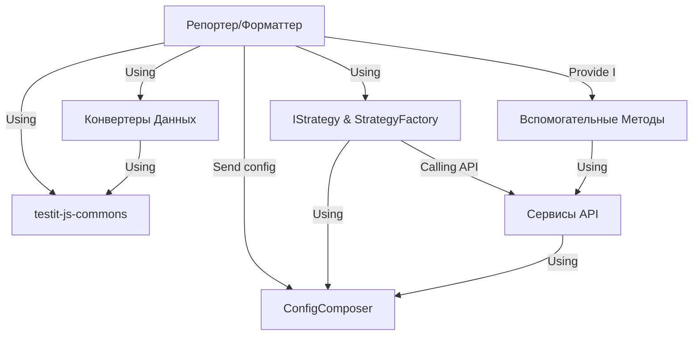

# Tutorial: adapters-js

Проект **adapters-js** — это *набор мостов* (адаптеров), которые позволяют отправлять результаты автоматических тестов из различных JavaScript-фреймворков (таких как Jest, Playwright, Cucumber) в систему управления тестированием **Test IT**.

Ключевые компоненты:
*   **Общая Библиотека (`testit-js-commons`)**: Основа, предоставляющая общую логику (работу с API Test IT, конфигурацию) для всех адаптеров.
*   **Репортер/Адаптер**: Специальный компонент для *каждого* фреймворка, который собирает результаты тестов.
*   **Вспомогательные Методы**: Функции (`testit.addLinks`, `this.addAttachments` и т.д.), позволяющие *добавлять* дополнительную информацию (ссылки, вложения, сообщения) прямо из кода теста.

Адаптер "слушает" события тестового фреймворка, преобразует данные в нужный формат с помощью **Конвертеров** и отправляет их в Test IT через **Сервисы API**, используя выбранную **Стратегию Интеграции**, настройки для которой берутся из **Менеджера Конфигурации**.

**Source Repository:** [https://github.com/testit-tms/adapters-js](https://github.com/testit-tms/adapters-js)

## Chapters

1. [Репортер/Форматтер Адаптера
](01_репортер_форматтер_адаптера_.md)
2. [Менеджер Конфигурации (ConfigComposer)
](02_менеджер_конфигурации__configcomposer__.md)
3. [Вспомогательные Методы (Additions, Metadata, testit)
](03_вспомогательные_методы__additions__metadata__testit__.md)
4. [Общая Библиотека (testit-js-commons)
](04_общая_библиотека__testit_js_commons__.md)
5. [Стратегия Интеграции (IStrategy & StrategyFactory)
](05_стратегия_интеграции__istrategy___strategyfactory__.md)
6. [Конвертеры Данных
](06_конвертеры_данных_.md)
7. [Сервисы API (AutotestsService, TestRunsService, AttachmentsService)
](07_сервисы_api__autotestsservice__testrunsservice__attachmentsservice__.md)

---

Generated by [AI Codebase Knowledge Builder](https://github.com/The-Pocket/Tutorial-Codebase-Knowledge)